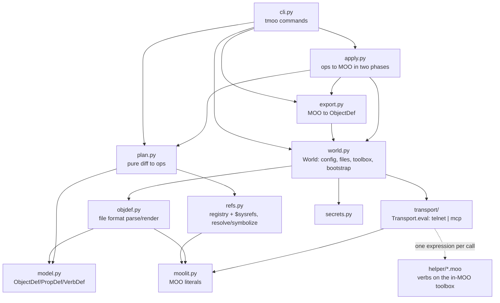

# REVIEW.md — reading terramoo's implementation

Last updated: 2026-09-23, commit f0d881d

terramoo (`tmoo`) keeps a MOO player's objects as text files. `tmoo apply`
makes the live MOO match the files, and `tmoo pull` writes live edits back
into them. It works like Terraform, but for one player's objects in a
LambdaMOO-family world. This doc maps the *implementation* for someone who
has to review or hand-write code here. It is not a user guide.

**Suggested path:** read §1 in full (about 15 minutes), skim §2 to see where
the weight is, then follow §3 with the code open. §5 is for reference while
you work.

This doc is regenerated wholesale from the code, so hand edits will be lost
on the next regeneration.

**Companion docs.** [README.md](README.md) owns the user view: commands, the
file format, `world.toml`, the transports and the testbeds.
[AGENTS.md](AGENTS.md) owns the hard rules for changing code (portability,
single expressions, `caller_perms()`, secrets). This doc explains *why* the
code looks the way it does and links to those two instead of repeating them.
[CLAUDE.md](CLAUDE.md) only includes AGENTS.md.

---

## 1. High-level architecture

### The one-paragraph model

terramoo is a **plan/apply reconciler with a remote-procedure boundary**.
The files and the live MOO are both read into one in-memory model
(`ObjectDef`). A pure function diffs the two into a list of *ops*
(tuples such as `("setprop", @hall, "description", …)`). Those ops are
serialized as MOO literals and executed *inside the MOO* by a helper verb
that runs as the player. Python never runs MOO statements itself. Each
request it sends is a single MOO expression, usually a call to one of four
helper verbs on a "toolbox" object that the player owns.

> The sentence to repeat while reading: **"Files speak names, the MOO
> speaks numbers. Everything in between is resolving one to the other and
> diffing."**

### Layer map



Dependencies point downward only. `moolit` and `model` are leaves.
`plan` never imports `world` or a transport, which is why it can be tested
offline. `apply` imports `export` lazily inside `_replan_created`
([terramoo/apply.py](terramoo/apply.py)) to avoid an import cycle.

| Layer | Files | Responsibility |
|---|---|---|
| Values | [moolit.py](terramoo/moolit.py) | Parse and serialize MOO literal text: `Obj`, `Err`, `Sym`, `Map`, and the repo's own `Ref` (`$name` / `@key`) |
| Model | [model.py](terramoo/model.py) | `ObjectDef` / `PropDef` / `VerbDef`, plus flag and perm normalization |
| Format | [objdef.py](terramoo/objdef.py) | One object per file: `parse` ↔ `render` |
| Names | [refs.py](terramoo/refs.py) | `Refs`: registry (key → `#n`), sysrefs (`$name` → `#n`), pending creates; `state.json` I/O |
| Diff | [plan.py](terramoo/plan.py) | `build(files, live, refs) → Plan` and `diff_object`. Pure apart from setting `refs.pending` |
| Read | [export.py](terramoo/export.py) | Calls `tmoo_export` in chunks and turns each record into a symbolized `ObjectDef` |
| Write | [apply.py](terramoo/apply.py) | Runs a `Plan`: creates, re-read, re-diff, batched ops, optional recycle |
| World | [world.py](terramoo/world.py) | `world.toml`, file I/O, the lazy transport, player/toolbox discovery, `bootstrap`, `DEFAULT_IGNORE_PROPS` |
| Wire | [transport/](terramoo/transport/__init__.py) | `Transport.eval(expr) → value`; [telnet.py](terramoo/transport/telnet.py) and [mcp.py](terramoo/transport/mcp.py) |
| In-MOO | [helper/](terramoo/helper/tmoo_apply.moo) | Four verbs in plain LambdaMOO 1.8, installed on the toolbox |
| Shell | [cli.py](terramoo/cli.py), [secrets.py](terramoo/secrets.py) | argparse commands; password/token lookup |

### Runtime flow: `tmoo apply`

1. **Load the world.** `cli.main` → `cmd_apply` → `_world` →
   `find_root` (nearest `worlds/`, or `$TMOO_ROOT`) → `World.load` reads
   `worlds/<name>/world.toml` ([terramoo/world.py](terramoo/world.py)).
2. **Connect lazily.** The first `World.eval` touches `World.transport`,
   which calls `secret_for` ([terramoo/secrets.py](terramoo/secrets.py))
   and then `transport.connect`. For telnet, `Telnet._open` logs in and
   confirms the login with a tagged `player` request
   ([terramoo/transport/telnet.py](terramoo/transport/telnet.py)).
3. **Build `Refs`.** `World.refs()` reads `player`, the toolbox's
   `registry` property (two parallel lists → dict via `registry_value`)
   and `tmoo_sysrefs()`.
4. **Read both sides.** `World.load_files()` parses every
   `objects/*.moo` with `objdef.parse`. `export.export()` calls
   `toolbox:tmoo_export({#a, #b, …})` for registered keys, `CHUNK = 8`
   objects per call. `_to_def` symbolizes numbers back to `@key` / `$name`
   and drops `ignore_props`.
5. **Diff.** `plan.build` ([terramoo/plan.py](terramoo/plan.py)):
   - flags `@refs` to keys with no file as *problems*;
   - lists creates for keys not in the registry or gone from the MOO,
     in parent-first order (`_topo`);
   - calls `diff_object` per file, emitting ops in a fixed order
     (name, chparent, move, flags, props, verbs);
   - lists registry keys with no file as `destroys`;
   - appends one `("link", [...])` op when anything changed.
6. **Confirm.** `_print_plan` prints the plan and `cmd_apply` asks
   `apply? [y/N]` unless `-y` was given.
7. **Apply in phases.** `apply.run` ([terramoo/apply.py](terramoo/apply.py)):
   - **creates**: one batch of `["create", key, parent, name]`. A parent
     can be a *string key* created earlier in the same batch, which the
     helper looks up in the registry it is building;
   - **re-read**: the registry again, then `_replan_created` exports the
     new objects and diffs them *again*, because a core's `initialize`
     sets properties of its own (LambdaCore's `key = 0`);
   - **ops**: `_resolve_op` turns each `Ref` into an `Obj`, and `_send`
     packs ops into batches under `transport.batch_bytes`, one
     `tmoo_apply` eval per batch, with one `{1, value}` / `{0, err, msg}`
     result per op;
   - **recycle**: only with `--destroy`, as `recycle` + `unregister`
     pairs.
8. **Persist.** `World.save_state` mirrors the registry into
   `worlds/<name>/state.json`.

`pull` runs steps 1–4 and then `objdef.render` →
`World.write_file`. `ordered_like` keeps the existing file's order of
properties and verbs. `diff` renders both sides and runs
`difflib.unified_diff`. `adopt` sends `register` ops and then pulls.

### State ownership

| State | Where it lives | Who changes it |
|---|---|---|
| **Registry** (key → object) | In the MOO: `toolbox.registry = {{keys}, {objs}}` | Only `tmoo_apply` (`create` / `register` / `unregister`). It is written back after *every* change, so a crash mid-apply leaves the MOO knowing what it made |
| Registry mirror | `worlds/<w>/state.json` | `refs.save_state`. Informational only: nothing reads the registry back from it (`World.load_state` has no caller) |
| Object definitions | `worlds/<w>/objects/<key>.moo` | The user; `pull` / `adopt` overwrite them |
| Toolbox pointer | `player.tmoo` property | `World.bootstrap` |
| `Refs` for a run | An in-process `Refs` object | `plan.build` sets `pending`; `apply.run` re-reads `registry` and calls `reindex()` |
| Connection | `World._transport`, opened lazily | `World.close()`, called from `cli.main`'s `finally` for every world in `_open` |
| Secret | env / Keychain / `~/.config/terramoo/` | `tmoo secret store` |

Because the registry lives in the MOO, a MOO rollback rolls it back too,
and `plan` simply sees whatever is missing.

### Boundaries

- **Pure and offline-tested:** `moolit`, `model`, `objdef`, `refs`
  (except the state file), `plan`, `secrets.check_secret`.
- **Talks to the MOO:** `World` methods that call `eval`, `export`,
  `apply`, `bootstrap`, and the `cli` commands.
- **The seam:** `Transport.eval(expression) -> value`
  ([terramoo/transport/__init__.py](terramoo/transport/__init__.py)).
  Everything else is built on it, plus two overridable conveniences:
  `set_prop` and `install_verb`. The tests replace the transport with a
  socket fake ([tests/test_telnet.py](tests/test_telnet.py)) or a stubbed
  `call_tool` ([tests/test_mcp.py](tests/test_mcp.py)).
- **Platform:** `secrets.py` shells out to macOS `security` on darwin and
  falls back to a mode-0600 file elsewhere.

### Key design decisions and invariants

1. **Keys, not numbers, are identity.** A file is named by its key.
   `#n` exists only in the registry and on the MOO side. A file never
   contains a managed object's number; it uses `@key`.
2. **Two resolution modes** (`Refs.resolve_ref(live=…)`,
   [terramoo/refs.py](terramoo/refs.py)). A value read *from the MOO*
   (`live=True`) resolves to the registry's current number even for a key
   being recreated, because the MOO still holds the recycled number. A
   value *from a file* stays a `Ref` while its key is `pending`, until
   the create has run. If you mix these up, a recreated object is compared
   against a dead number. See
   `test_reference_to_a_recreated_object_waits_for_its_new_number`.
3. **Every expression sent is a single expression.** No `;`, no
   backquotes, no statements, because a hosted MCP gate evaluates exactly
   one expression. Loops and `try` belong in helper verbs. Assignments are
   the exception, and they go through `Transport.set_prop` (AGENTS.md).
4. **Helpers are plain LambdaMOO 1.8.** No maps, `ancestors()`, `isa()`,
   `$..._utils`, type constants (compare with `typeof(#0)`) or list
   comprehensions. That is why the registry is two parallel lists and
   `tmoo_export` walks `parent()` by hand.
5. **Every helper starts with the `caller_perms()` check.** A helper runs
   with the player's permissions, so without the check anyone could call
   it.
6. **Suspending is opt-in per call.** `World.helper` appends a final
   `may_suspend` argument for `tmoo_export` / `tmoo_apply`, from
   `transport.can_suspend`: telnet `True`, MCP `False`.
7. **Runtime state never reaches a file.** Properties that the MOO writes
   by itself belong in `DEFAULT_IGNORE_PROPS`
   ([terramoo/world.py](terramoo/world.py)) or a world's `ignore_props`.
   Don't special-case them in `plan`.
8. **Nothing is recycled without `--destroy`.** Plain `apply` only
   creates and updates. Registry keys without a file are listed as
   "orphan".
9. **One failed op doesn't stop the batch.** `tmoo_apply` wraps each op
   in `try` and returns one result per op. `apply._send` records failures
   and carries on.
10. **Keys are case-insensitive** because the MOO's `in` is.
    `World.load_files` refuses two keys that differ only in case.

---

## 2. Quantitative metrics

**Lines by language** (`tokei -e uv.lock -e LICENSE .`, 42 files):

| Language | Files | Code | Comments | Blanks | Lines |
|---|---:|---:|---:|---:|---:|
| Python | 25 | 2676 | 59 | 477 | 3212 |
| Shell | 9 | 315 | 54 | 37 | 406 |
| Markdown | 6 | — | 227 | 40 | 267 |
| TOML / YAML | 2 | 35 | 6 | 5 | 46 |

tokei doesn't recognize `.moo`. The four helper verbs total 218 lines
(`wc -l terramoo/helper/*.moo`).

**Lines by area** (`wc -l` over `*.py`, `*.moo`, `*.sh`, `*.yaml`):

| Area | Lines | Files | Notes |
|---|---:|---:|---|
| `terramoo/*.py` (core) | 1795 | 12 | shipped package, top level |
| `terramoo/transport/` | 515 | 3 | telnet 313, mcp 127, base 75 |
| `terramoo/helper/*.moo` | 218 | 4 | runs inside the MOO |
| `tests/` | 576 | 6 | test-to-source ratio ≈ 0.23 (576 / 2528) |
| `testbeds/` | 756 | 18 | build/run scripts; not shipped |

**Dependencies** (`uv tree`): **0** runtime dependencies (stdlib only,
Python ≥ 3.12 for `tomllib`). 1 direct dev dependency (`pytest`), with 4
transitive ones (`iniconfig`, `packaging`, `pluggy`, `pygments`). Build
backend: `hatchling`.

**Tests** (`uv run pytest --collect-only -q`): 52 collected from 32 test
functions in 6 files. The offline run gives 51 passed and 1 skipped, the
skip being the live round trip unless `TMOO_LIVE` is set.

| File | Functions | Covers |
|---|---:|---|
| [tests/test_plan.py](tests/test_plan.py) | 10 | `plan.build` / `diff_object`, ref resolution |
| [tests/test_format.py](tests/test_format.py) | 9 (1 parametrized) | literal round trips, objdef parse/render, `ordered_like` |
| [tests/test_telnet.py](tests/test_telnet.py) | 6 | framing, errors, compile detection, IAC, against a socket fake |
| [tests/test_mcp.py](tests/test_mcp.py) | 4 | `toliteral` wrapping, tag stripping, `set_verb` tool |
| [tests/test_secrets.py](tests/test_secrets.py) | 2 (1 parametrized) | `check_secret` |
| [tests/test_live.py](tests/test_live.py) | 1 | full CLI round trip against a real MOO |

With no fakes, these have **no offline coverage**: `apply.py`,
`export.py`, `world.py` (bootstrap, toolbox discovery), `cli.py`, and the
helper verbs. Only `test_live.py` exercises them, against a testbed.

**Largest source files** (`wc -l`): `transport/telnet.py` 313,
`world.py` 312, `cli.py` 304, `objdef.py` 267, `moolit.py` 224,
`plan.py` 208, `helper/tmoo_apply.moo` 146.

**Git shape** (`git rev-list --count HEAD`, `git log`): 10 commits from
2026-09-21 to 2026-09-23. Three of them share one timestamp (the
transports, testbeds and docs commits). The two initial commits add
2170 and 1388 lines. **Churn isn't a useful review signal here.** The top
file, `cli.py`, has 5 touches (`git log --format= --name-only | sort |
uniq -c | sort -rn`), and that mostly reflects bulk commits. The
intent lives in the module docstrings, [README.md](README.md) and
[AGENTS.md](AGENTS.md), and in the commit bodies of `b5affd5`, `1dac289`
and `2a80b6c`.

**Domain counts:** 10 subcommands (`init secret bootstrap status pull
export adopt plan apply diff`), 19 op kinds in `tmoo_apply`, 36 entries
in `DEFAULT_IGNORE_PROPS`, 3 testbed servers on ports 17001–17003.

---

## 3. Source modules — reading order

**Tier 0: orientation (10 min).** Read [pyproject.toml](pyproject.toml)
(no runtime dependencies; `tmoo = terramoo.cli:main`), the
[README.md](README.md) "The file format" and "How it works" sections, and
[AGENTS.md](AGENTS.md) "Rules". Then open
[terramoo/helper/tmoo_apply.moo](terramoo/helper/tmoo_apply.moo) and read
just the list of `kind ==` branches. That list is the op vocabulary
everything else produces.

**Tier 1: read fully (about 90 min).** Read these in this order; each one
assumes the ones before it.

1. [terramoo/moolit.py](terramoo/moolit.py) (224 lines). The value types.
   Read the module docstring table, then `Obj`, `Ref`, `Map`, `parse`,
   `serialize` and `walk`. Skim the tokenizer regex. Everything else
   passes these types around, and `Ref` is the repo's own addition to
   MOO syntax.
2. [terramoo/model.py](terramoo/model.py) (88 lines). `ObjectDef`,
   `PropDef.defined` (a `property` vs. an `override`), `VerbDef.key` (the
   first verb name), `ordered_like`. This is the shape both sides of the
   diff take.
3. [terramoo/refs.py](terramoo/refs.py) (102 lines). `Refs.resolve_ref`
   (read the `live` docstring twice), `symbolize_obj`, `reindex` (the
   shortest `$name` wins; negative `$` objects stay numbers). This is
   where "names vs. numbers" is implemented.
4. [terramoo/plan.py](terramoo/plan.py) (208 lines). `build`, then
   `diff_object`, then `_topo`. Note the `h()` / `r()` split between live
   and file resolution, and that `build` sets `refs.pending`. `describe`
   is display-only. This is the heart of the tool, and it is pure.
5. [terramoo/helper/tmoo_apply.moo](terramoo/helper/tmoo_apply.moo)
   (146 lines). The receiving end of every op. Read `create` (a string
   parent means a key from this batch), the registry writes, `addverb`
   (sets code on verb index `length(verbs(o))`), and `link`.
6. [terramoo/apply.py](terramoo/apply.py) (134 lines). `run`,
   `_replan_created`, `_resolve_op`, `_send`. The two-phase sequence and
   batching.
7. [terramoo/world.py](terramoo/world.py) (312 lines). `World.load`,
   `helper` (the `may_suspend` argument), `player`, `toolbox`,
   `bootstrap`, `refs`, `DEFAULT_IGNORE_PROPS`. `_find_orphan_toolbox` can
   wait for a second pass.
8. [terramoo/transport/__init__.py](terramoo/transport/__init__.py)
   (75 lines). The `Transport` contract, `set_prop`, `install_verb`,
   `connect`.

**Tier 2: read the docstrings and signatures, then the parts that matter
to your change (about 45 min).**

9. [terramoo/transport/telnet.py](terramoo/transport/telnet.py) (313
   lines). Read the module docstring (the tag protocol) and then
   `program` and `_request`. Those two are the trickiest code in the repo.
   `_Wire._strip_iac` is telnet plumbing, so skip it on a first pass.
10. [terramoo/transport/mcp.py](terramoo/transport/mcp.py) (127 lines).
    `eval` (the `toliteral()` wrap, `_TAGGED` stripping, JSON decode) and
    `rpc` (SSE or plain JSON).
11. [terramoo/objdef.py](terramoo/objdef.py) (267 lines). `render` first,
    since it is short and shows the format, then `parse` and
    `_read_statement` (multi-line values ending at `;`, string- and
    bracket-aware).
12. [terramoo/export.py](terramoo/export.py) (71 lines). `export`,
    `_to_def`, `slug` (key generation for `adopt --owned`).
13. [terramoo/helper/tmoo_export.moo](terramoo/helper/tmoo_export.moo)
    (47 lines). The record shape that `_to_def` unpacks. Inherited
    properties appear only when they are set on the object itself.
14. [terramoo/cli.py](terramoo/cli.py) (304 lines). `main`, then
    `cmd_apply` / `_plan` / `_print_plan`, then `cmd_adopt`. The rest is
    straightforward.

**Tier 3: reference only.**

- [terramoo/secrets.py](terramoo/secrets.py): lookup order and
  `check_secret`.
- [terramoo/helper/tmoo_sysrefs.moo](terramoo/helper/tmoo_sysrefs.moo),
  [terramoo/helper/tmoo_info.moo](terramoo/helper/tmoo_info.moo): tiny
  read-only helpers.
- [terramoo/errors.py](terramoo/errors.py), [terramoo/__init__.py](terramoo/__init__.py).
- `testbeds/*/`: shell scripts that build three servers from source. Read
  one only when a live run breaks. The READMEs record server quirks:
  [testbeds/lambdamoo/README.md](testbeds/lambdamoo/README.md),
  [testbeds/toaststunt/README.md](testbeds/toaststunt/README.md),
  [testbeds/moor/README.md](testbeds/moor/README.md).
  `testbeds/moor/probe.py` records what a non-wizard can do on mooR.
- [uv.lock](uv.lock): generated, never edit.

### Test reading order

The tests are the clearest statement of intended behavior:

1. [tests/test_plan.py](tests/test_plan.py). Read it right after
   `plan.py`. `test_every_kind_of_change` pins the op order;
   `test_new_object_sets_everything_and_is_created_parents_first` shows
   string-key parents and `Ref`s surviving until apply;
   `test_reference_to_a_recreated_object_waits_for_its_new_number` is
   invariant 2.
2. [tests/test_live.py](tests/test_live.py). The whole product in 116
   lines: apply, `no changes`, exit linking, byte-exact pull, diff, a
   compile error that leaves the old code, and recreation after an
   out-of-band recycle.
3. [tests/test_format.py](tests/test_format.py). Literal and objdef round
   trips, including a `;` inside a string value.
4. [tests/test_telnet.py](tests/test_telnet.py). Read it with the telnet
   docstring. `FakeMoo` shows what a MOO connection looks like
   (noise, echo, untagged compile errors).

---

## 4. Third-party modules

| Package | Version | Kind | Used for, and where |
|---|---|---|---|
| *(none at runtime)* | — | — | The package imports only the stdlib: `socket`/`ssl` (telnet), `urllib.request` (MCP), `tomllib` (world.toml), `subprocess` (`security` Keychain CLI), `argparse`, `difflib`, `getpass`, `dataclasses`, `re`, `json` |
| `pytest` | ≥ 8 (locked 9.1.1) | dev | Every file in `tests/`. `monkeypatch`, `tmp_path`, `capsys`, `parametrize`, `skipif` |
| `hatchling` | unpinned | build-time | Wheel build (`[build-system]` in [pyproject.toml](pyproject.toml)) |

The transitive tail is 4 packages, all pulled in by pytest.

**External tools the testbeds need** (not Python dependencies): Homebrew
`cmake bison gperf nettle argon2 pcre2 openssl@3` for ToastStunt, a Rust
toolchain for mooR (pinned to tag 1.0.2, commit `7caba6e`, in
[testbeds/moor/setup.sh](testbeds/moor/setup.sh)), and a C compiler for
LambdaMOO 1.8.1 (tarball sha256-checked in
[testbeds/lambdamoo/setup.sh](testbeds/lambdamoo/setup.sh)). mooR is
pinned on purpose: on `main`, command verbs need the `x` flag, which
breaks `;` eval for non-wizards.

---

## 5. Comprehension aids

### Glossary

| Term | Meaning |
|---|---|
| MOO | A text-based multi-user world whose objects and code (verbs) live in a database and are programmed in the MOO language |
| LambdaMOO / ToastStunt / mooR | Three MOO servers: classic C 1.8.1, an extended C++ fork, a Rust reimplementation |
| Core | The database a server runs (LambdaCore, ToastCore, lambda-moor). It supplies `$room`, `$thing`, `$exit`, `;` eval |
| Programmer / wizard | Player bits: a programmer can write code; a wizard bypasses permissions. terramoo needs only the first |
| `#123` | An object number. mooR can also have UUID objects `#048D05-1234567890` (`Obj.num` is then a `str`) |
| Corified / `$name` | An object stored on a property of `#0`, e.g. `$room` = `#0.room`. Read by `tmoo_sysrefs` |
| `@key` | This repo's syntax for a managed object, by registry key. `@me` is the player |
| Key | A file's stem and registry name; an object's stable identity |
| Registry | `toolbox.registry`: `{{keys}, {objects}}` |
| Toolbox | The object the player owns (`player.tmoo`, named "terramoo toolbox") that holds the registry and helpers |
| Helper | One of the four `tmoo_*` verbs from `terramoo/helper/` |
| Op | A tuple/list whose first element names a `tmoo_apply` branch |
| `property` vs `override` | A property defined on this object vs. a value set on an inherited one (`PropDef.defined`) |
| Clear property | An inherited property with no local value. An `override` removed from a file becomes `clearprop` |
| objdef | The file format, shaped like mooR's objdef export |
| Link | The final op, which adds managed `$exit`s to their `source.exits` / `dest.entrances` |
| `toliteral()` | The MOO builtin that prints a value as source text. Every answer crosses the wire in this form |
| `;` / `;;` | LambdaCore eval: `;expr` evaluates an expression, `;;stmts` runs statements |
| Tag / sentinel | The telnet transport's per-request `~xxxxxxxxxx~` prefix and the trailing `Z` command (see telnet docstring) |
| Gate | A hosted MCP server that exposes `eval` (and optionally `set_verb` / `set_prop`) tools |
| Ticks / `suspend(0)` | A MOO task's CPU budget. Suspending yields and resets it |

### Conventions

- **Prose docstrings carry the design.** Every module opens with a
  docstring explaining *why*. Comments are sparse and state constraints,
  not what the code does. Match that density.
- **One error type at the boundary.** Anything user-facing raises
  `MooError` ([terramoo/errors.py](terramoo/errors.py)); `cli.main`
  prints `tmoo: <message>` and exits 1. Internal errors (`FormatError`,
  `LiteralError`, `UnresolvedRef`) are converted to `MooError` or to
  plan *problems* before they reach the CLI.
- **Plan problems, not exceptions.** Anything a user can fix in their
  files (a dangling `@ref`, an unknown `$name`, a `property`/`override`
  mismatch) is appended to `Plan.problems`. `plan` exits 2 and `apply`
  refuses to run.
- **Ops are tuples in `plan`, lists after `_resolve_op`.** Object
  arguments stay `Ref("@", key)` until apply time.
- **Normalized flag strings:** object flags are a subset of `rwf`,
  property perms of `rwc`, verb perms of `rwxd`, always in that order
  (`normalize_flags` / `normalize_perms`).
- **Style:** `from __future__ import annotations` everywhere, dataclasses
  for models, lines up to about 120 characters, no type-checker or linter
  config in the repo.
- **Commits:** Conventional Commits; scopes seen so far are `apply`,
  `secrets`, `testbeds`.

### How to run and verify

```sh
uv run pytest                    # offline suite: 51 passed, 1 skipped
testbeds/toaststunt/setup.sh && testbeds/toaststunt/start.sh --fresh
TMOO_LIVE=127.0.0.1:17001:tester:tester uv run pytest tests/test_live.py
testbeds/toaststunt/stop.sh
```

Ports: 17001 ToastStunt, 17002 LambdaMOO 1.8.1, 17003 mooR. After
touching a helper, a transport, or plan/apply, run the live test on
**all three** (AGENTS.md). One testbed at a time is enough; stop each one
when done. There is no CI config in the repo.

### Common change recipes

**Add a new kind of op** (for example, setting an object's `f` flag
separately):
1. [terramoo/plan.py](terramoo/plan.py) `diff_object`: emit the tuple in
   the right position of the fixed order. If it needs a label, update
   `describe`.
2. [terramoo/helper/tmoo_apply.moo](terramoo/helper/tmoo_apply.moo): add
   an `elseif (kind == "...")` branch in LambdaMOO 1.8 syntax.
3. [terramoo/apply.py](terramoo/apply.py) `_resolve_op`: only if the op
   has an unusual argument shape.
4. [tests/test_plan.py](tests/test_plan.py): extend
   `test_every_kind_of_change`. Then `tmoo bootstrap` and a live run on
   all three testbeds.

**Ignore another runtime property:** add it to `DEFAULT_IGNORE_PROPS`
in [terramoo/world.py](terramoo/world.py) (or `ignore_props` in one
world's `world.toml`). Nothing else changes.

**Add a `world.toml` connection option:**
1. The transport's `__init__` keyword argument and its `from_config`
   (telnet's `keys` tuple, or `McpTransport.from_config`).
2. The commented example in [README.md](README.md) "Worlds" and the
   docstring in [terramoo/world.py](terramoo/world.py).

**Add a CLI command:** a `cmd_*` function plus a subparser in `main`
([terramoo/cli.py](terramoo/cli.py)). Open the world with `_world(args)`
so it gets closed, and raise `MooError` for user errors.

**Change the file format:** `render` and `parse` in
[terramoo/objdef.py](terramoo/objdef.py) together, a round trip in
[tests/test_format.py](tests/test_format.py), the README "The file
format" section, and the objdef docstring. The live test asserts that
pull is byte-exact, so the rendering has to stay deterministic.

### Gotchas and traps

- **Helpers must be reinstalled after editing.** The `.moo` files are
  read by `World.bootstrap`; the running MOO keeps the old code until
  `tmoo bootstrap`. `test_live.py` bootstraps in its fixture.
- **Helper code runs everywhere or nowhere.** A map literal, `isa()`,
  `$list_utils` or `TYPE_OBJ` works on ToastStunt and then fails on
  LambdaMOO 1.8.1 or mooR. Compare types with `typeof(#0)`,
  `typeof("")`, `typeof(E_NONE)`.
- **Never put `;` or backquotes in a Python-built expression.** The MCP
  gate rejects statements. The telnet transport's `program()` is the only
  place that writes statements, and it wraps the expression itself.
- **No newlines in any value sent over telnet.** MOO literals have no
  newline escape, so `_request` raises. A string property containing
  `\n` can't be applied over telnet.
- **The op vocabulary has no single table.** It is defined twice: by
  `plan.diff_object` (producer) and by `tmoo_apply`'s branches (consumer).
  A new op kind needs both.
- **Only `MooError` is caught at the CLI.** Any other exception that
  escapes a command is a traceback, so user mistakes must become a
  `MooError` or a plan problem (as a parent loop and a bad `adopt`
  object argument do).
- **`plan.build` changes its `refs`.** It sets `refs.pending`, and
  `apply.run` depends on that. Build a fresh `Refs` per plan.
- **`addverb` sets code by index.** It calls `set_verb_code(o,
  length(verbs(o)), …)` right after `add_verb`, assuming the new verb is
  the last one. Don't insert anything between the two calls.
- **Batch sizes are per transport.** Telnet defaults to
  `batch_bytes = 16_000` with `chunk = 900`-character output lines; MCP
  and the base class default to 24 000. Export always sends `CHUNK = 8`
  objects per call, sized for an 8-second gate budget.
- **Two `tmoo` processes on one world will fight.** A second login boots
  the first on LambdaCore-family cores. Telnet reconnects between
  requests and never during one, so an op can't run twice.
- **The live test's teardown runs `apply --destroy`.** It skips itself if
  the player's registry holds any key not starting with `tmoo_test_`.
  Still, only point `TMOO_LIVE` at a scratch account.
- **`store_secret` passes the secret in argv on macOS**
  (`security add-generic-password … -w <secret>`), so it is briefly
  visible in the process list.

### Where the bodies are buried

- `Telnet._request` ([terramoo/transport/telnet.py](terramoo/transport/telnet.py)):
  a hand-rolled state machine over an untrusted line stream (S/B/D/E/X/Z,
  deadlines that extend while the MOO keeps talking, a lost sentinel, a
  compile error inferred from `Z` arriving without `S`). It has good
  fakes, but slow down here.
- `diff_object`'s live/file resolution split: the most likely place for a
  subtle "never converges" bug. Check any change against `plan` printing
  `no changes` after an apply in the live test.
- `apply._replan_created` exists because the first plan can't converge
  in one run (commit `2a80b6c`). It filters and reorders `plan_ops` by
  hand; `link` must stay last.
- `World.load_state` and the `toolbox` field in `state.json` are written
  and never read back, so the mirror is currently documentation only.
- The orchestration layer (`apply`, `export`, `world`, `cli`) has no
  offline tests; only the live test covers it.

### Further reading

1. [README.md](README.md): commands, file format, transports, portability notes.
2. [AGENTS.md](AGENTS.md): the rules a change must respect.
3. The module docstrings of `telnet.py`, `refs.py`, `plan.py` and `objdef.py`.
4. The testbed READMEs, for server-specific behavior.
5. `git log` bodies of `b5affd5`, `1dac289`, `2a80b6c`.
