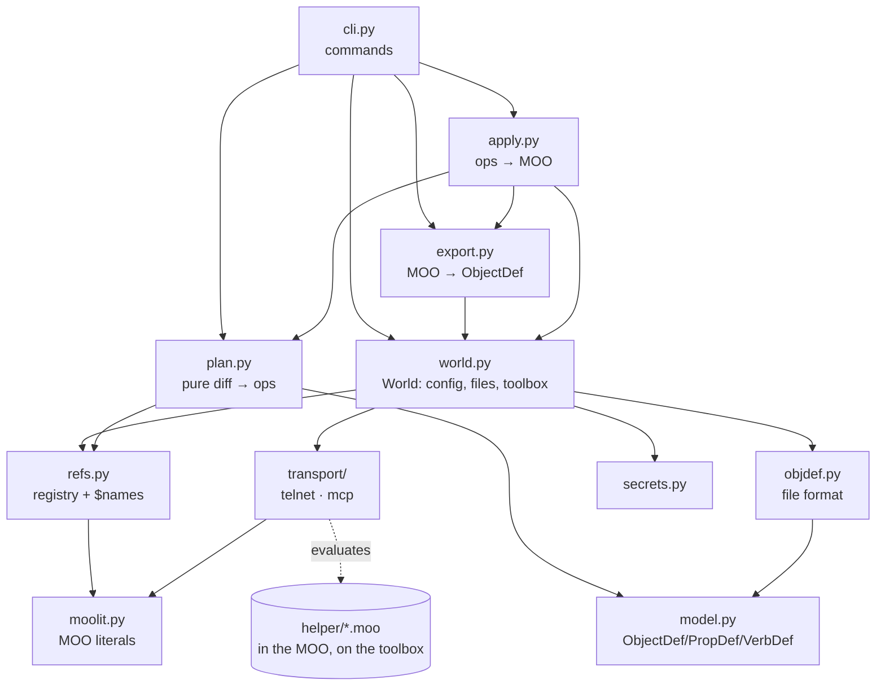

# REVIEW.md — reading terramoo's code

Last updated: 2026-09-23, commit 4d036a8.
This doc is regenerated wholesale from the code; hand edits are lost on the
next regeneration.

terramoo (`tmoo`) keeps a MOO player's objects as text files and makes a live
MOO match them, the way Terraform does for infrastructure. This doc is for
someone who has to review or hand-write code here, so it maps the
implementation, not the features. Read §1 in full. Skim §2 to see where the
size is. Then follow §3 with the code open, and keep §5 for the traps.

Companion docs:

- [README.md](README.md) is the user view: commands, `world.toml`, the file
  format, portability notes and testbeds. This doc links to it instead of
  repeating it.
- [AGENTS.md](AGENTS.md) holds the rules an agent must not break. They are
  restated here as invariants, with the reasoning behind them.
- The testbed READMEs under [testbeds/](testbeds/) cover the three servers
  used for live tests.

---

## 1. High-level architecture

### The one-paragraph model

`tmoo` is a small **plan/apply CLI**. It reads two sides into the same
object model: the files (`worlds/<w>/objects/*.moo`) and the live objects
(exported through a helper verb in the MOO). It diffs them into a list of
**ops** and sends the ops to a second helper verb that runs them one by one.
Everything happens **as the player**, through one channel: evaluating a
single MOO expression. The sentence to keep in mind while reading:

> **Files speak keys, the MOO speaks object numbers, and the registry on the
> toolbox is the only thing that translates between them.**

### Layers



| Layer | Files | Responsibility |
|---|---|---|
| Values | [moolit.py](terramoo/moolit.py) | Parses the MOO `toliteral()` text into Python and serializes it back. Defines `Obj`, `Err`, `Sym`, `Map` and terramoo's own `Ref` (`$name` / `@key`). |
| Model | [model.py](terramoo/model.py), [objdef.py](terramoo/objdef.py) | `ObjectDef`, `PropDef` and `VerbDef`, plus the file format that parses into them and renders out of them. |
| Names | [refs.py](terramoo/refs.py) | `Refs`: the registry (key → `Obj`) and the sysrefs (`$name` → `Obj`). It resolves a `Ref` to an `Obj` and symbolizes an `Obj` back to a `Ref`. |
| Diff | [plan.py](terramoo/plan.py) | `build()` / `diff_object()`: takes two dicts of `ObjectDef` and returns a `Plan` (creates, ops, destroys, problems). Pure. |
| MOO I/O | [export.py](terramoo/export.py), [apply.py](terramoo/apply.py), [world.py](terramoo/world.py) | Read live objects, run a plan, bootstrap the toolbox and keep `state.json` up to date. |
| Wire | [transport/](terramoo/transport/__init__.py) | `eval(expression) → value` over telnet (any MOO) or MCP (hosted gates). |
| In-MOO | [helper/*.moo](terramoo/helper/) | Four verbs installed on the toolbox. They do every loop and every side effect. |
| Entry | [cli.py](terramoo/cli.py) | argparse, printing and exit codes. The `tmoo` script is `terramoo.cli:main` ([pyproject.toml](pyproject.toml)). |

Dependencies point downward only. `plan.py` imports only `model`, `moolit`
and `refs`, so it never touches a transport. `apply.py` imports `export`
inside a function (in `_replan_created`).

### Runtime flow: `tmoo apply`

1. **`cli.main`** → `cmd_apply` → `_world()`. It finds the root
   (`world.find_root`: `$TMOO_ROOT` or the nearest `worlds/`), then runs
   `World.load`, which reads `world.toml` and merges `ignore_props` /
   `keep_props` into `DEFAULT_IGNORE_PROPS`.
2. **`_plan(w)`** collects the inputs:
   - `w.refs()` connects on first use (`World.transport` → `transport.connect`
     → `secrets.secret_for`). It checks that the login matches `player` and
     reads the registry (`<toolbox>.registry`) and the sysrefs (`:tmoo_sysrefs`).
   - `w.load_files()` parses every `objects/*.moo`. It checks that each file
     name equals its `object` key and that no two keys differ only in case.
   - `export.export(w, refs, keys)` calls `:tmoo_export`, 8 objects per call
     (`CHUNK`). It turns each record into an `ObjectDef`, symbolizing numbers
     back to `@key` / `$name`. An object the registry names but the MOO has
     lost comes back as `None`.
3. **`plan.build(files, live, refs)`** works in this order:
   - It reports as problems any `@ref` to a key with no file.
   - It works out *new keys*: keys with no registry entry, or whose live
     object is gone (`gone`). It sets `refs.pending` to those keys.
   - It orders the creates parents first (`_topo`) and reports parent cycles.
   - It diffs every file (`diff_object`), lists as `destroys` the registry
     keys that have no file, and appends one final `("link", [@every key])` op.
4. **The CLI prints the plan.** Problems abort the apply. Without `-y` it
   asks for confirmation, then calls **`apply.run`**:
   - **Create phase.** It sends one `create` op per new key to `:tmoo_apply`
     and re-reads the registry. Keys whose create failed are dropped from
     `pending`. Then `_replan_created` exports the new objects again and
     re-diffs them, because the core's `initialize` has already set some
     properties (LambdaCore's `key = 0`, for one).
   - **Op phase.** It clears `refs.pending`, so a `@key` whose create failed
     now raises `UnresolvedRef`, and that op is logged as SKIP. Every other
     op is resolved to numbers and sent in batches of at most `batch_bytes`
     characters of serialized ops.
   - **Destroy phase** (only with `--destroy`): `recycle` + `unregister` for
     each orphan.
   - Finally it runs `w.save_state(refs.registry)`.
5. **Inside the MOO**, [tmoo_apply.moo](terramoo/helper/tmoo_apply.moo) runs
   each op in its own `try`, so each op gets its own result, either
   `{1, value}` or `{0, "E_X", msg}`. It writes `this.registry` after every
   registry change, and it `suspend(0)`s when it is low on ticks, if its last
   argument allows it.

`pull` and `adopt` follow the same steps in reverse: export → `ObjectDef` →
`objdef.render` → file. `model.ordered_like` keeps the property and verb
order of an existing file, because servers list inherited properties in
different orders.

### State ownership

| State | Where it lives | Written by |
|---|---|---|
| Registry (key → `#n`) | The MOO: `<toolbox>.registry`, as two parallel lists `{keys, objects}`. | Only `tmoo_apply` (`create`, `register`, `unregister`). |
| Registry copy | `worlds/<w>/state.json` | `refs.save_state`, after `bootstrap`, `pull`, `adopt` and `apply`. It is **never read back**. It exists for humans and git history. |
| Toolbox pointer | The MOO: `player.tmoo` | `World.bootstrap` |
| Object definitions | `worlds/<w>/objects/*.moo` | The user, `pull` and `adopt` |
| Secrets | `$TMOO_SECRET`, the macOS Keychain (service `terramoo`) or `~/.config/terramoo/<w>.secret` | `tmoo secret store` |
| Per-run caches | `World._transport`, `_player`, `_toolbox`; `Refs._by_obj` / `_sys_by_obj`; `Refs.pending` | In memory for one command. `cli._open` closes every transport in `main`'s `finally`. |

Because the registry lives in the MOO, a database rollback rolls the
registry back with it. The next plan then sees the missing objects as
`gone` and recreates them.

### Boundaries

- **Pure and unit-tested:** `moolit`, `model`, `objdef`, `refs`, `plan`.
- **Needs a `World`, tested against a fake:** `apply.run`
  ([tests/test_apply.py](tests/test_apply.py) fakes `tmoo_apply` and
  `tmoo_export` in Python).
- **Network, tested against fakes:** `transport/telnet.py` (a scripted
  socket in [tests/test_telnet.py](tests/test_telnet.py)) and
  `transport/mcp.py` (stubbed tool calls in [tests/test_mcp.py](tests/test_mcp.py)).
- **Only covered by the live round trip:** `World.bootstrap`, the four
  helpers, `export._to_def` against real servers, and `cli` end to end
  ([tests/test_live.py](tests/test_live.py), skipped unless `TMOO_LIVE` is set).
- **Platform:** `secrets.py` runs the macOS `security` CLI through
  `subprocess`. On any other OS it uses the config file.

### Key design decisions and invariants

1. **One expression per request.** Everything `tmoo` sends is a single
   expression: no `;`, no statements, no backquotes. The MCP gate evaluates
   exactly one expression, and the telnet `program()` wraps it in
   `_r = (expr)`. Loops and error handling belong in the helpers. The only
   assignments are in `Transport.set_prop`, which bootstrap uses and which
   MCP sends to its own tool.
2. **The helpers are plain LambdaMOO 1.8.** They use no maps, no
   `ancestors()`/`isa()`, no `$..._utils`, no `TYPE_*` constants (compare
   against `typeof(#0)` instead) and no list comprehensions. That is why the
   registry is two parallel lists. One copy of the helpers runs on
   LambdaMOO 1.8.1, ToastStunt and mooR.
3. **Every helper starts with the `caller_perms()` check.** A helper runs
   with the player's permissions, so without the check any other player
   could call it.
4. **`suspend(0)` only when told.** `World.helper` appends `1`/`0` for
   `tmoo_export` and `tmoo_apply` from `transport.can_suspend`. Telnet evals
   are ordinary tasks, but a hosted gate forbids suspending.
5. **Two resolution modes** (`Refs.resolve_ref(live=...)`). A value read
   from the MOO (`live=True`) resolves through the registry, even for a key
   being recreated, because the live object still holds the old, recycled
   number. A file's value for a pending key stays a `Ref` until the create
   has run. `diff_object` compares `file_ref(want)` against `live_ref(have)`
   and depends on this asymmetry.
6. **Runtime state is not definition.** Properties the MOO writes on its own
   go in `DEFAULT_IGNORE_PROPS` (or a world's `ignore_props`), which export
   filters out. Plan never special-cases them. Exits and entrances are in
   that list because the final `link` op rebuilds them.
7. **Nothing is recycled without `--destroy`.** A registry key with no file
   is only an "orphan" in `plan`.
8. **Failures are per op.** One failed op neither aborts the batch nor
   blocks state saving. Ops on an object whose create failed are skipped in
   Python, before anything is sent (commit `67f4450`).
9. **Keys are case-insensitive**, because MOO's `in` and string `==` ignore
   case. `World.load_files` rejects two keys that differ only in case.

---

## 2. Quantitative metrics

**LOC by area** (`for d in terramoo tests testbeds; do git ls-files $d | xargs cat | wc -l; done`,
and `tokei terramoo tests testbeds`):

| Area | Files | Lines | Notes |
|---|---:|---:|---|
| `terramoo/` Python | 15 | 2,159 | The package |
| `terramoo/helper/*.moo` | 4 | 198 | MOO code installed on the toolbox |
| `tests/` | 8 | 690 | Test-to-source ratio ≈ 0.32 |
| `testbeds/` | 17 | 716 | Shell and Python build/provision scripts. Not shipped. |

tokei over those three trees: Python 2,571 code lines in 26 files, Shell
315 code lines in 9 files.

**Largest files** (`git ls-files | xargs wc -l | sort -rn`):

| File | Lines |
|---|---:|
| [terramoo/cli.py](terramoo/cli.py) | 315 |
| [terramoo/transport/telnet.py](terramoo/transport/telnet.py) | 303 |
| [terramoo/world.py](terramoo/world.py) | 286 |
| [terramoo/objdef.py](terramoo/objdef.py) | 237 |
| [terramoo/plan.py](terramoo/plan.py) | 213 |
| [terramoo/moolit.py](terramoo/moolit.py) | 199 |
| [terramoo/helper/tmoo_apply.moo](terramoo/helper/tmoo_apply.moo) | 126 |
| [terramoo/apply.py](terramoo/apply.py) | 124 |

**Dependencies** (`uv tree`, [pyproject.toml](pyproject.toml)): **0 runtime
dependencies**, standard library only (`socket`, `ssl`, `urllib`, `tomllib`,
`json`, `subprocess`). The dev group has 1 direct dependency (`pytest`)
and 4 transitive ones (`iniconfig`, `packaging`, `pluggy`, `pygments`). The
build backend is `hatchling`. Requires Python ≥ 3.12.

**Tests** (`uv run pytest --collect-only -q`): 61 collected across 8 files.
60 pass offline and 1 is skipped: `test_live.py::test_round_trip` needs
`TMOO_LIVE`.

| File | Test functions | Covers |
|---|---:|---|
| [test_plan.py](tests/test_plan.py) | 11 | `plan.build` / `diff_object` |
| [test_format.py](tests/test_format.py) | 9+ | objdef parse and render, `moolit`, `ordered_like` |
| [test_telnet.py](tests/test_telnet.py) | 5+ | Chunked answers amid noise, MOO errors, login failure, the one-line program, telnet negotiation |
| [test_mcp.py](tests/test_mcp.py) | 4 | `toliteral()` wrapping, tagged answers, the `set_verb` tool |
| [test_apply.py](tests/test_apply.py) | 2 | Create phase and failed-create skipping |
| [test_cli.py](tests/test_cli.py), [test_secrets.py](tests/test_secrets.py) | 2+ / 1+ | `parse_object_arg`, `check_secret` |
| [test_live.py](tests/test_live.py) | 1 | The full round trip on a real server |

"+" marks files with a `pytest.mark.parametrize` test, which collects more
cases than it defines.

**Git shape** (`git rev-list --count HEAD`, `git log --reverse`): 20
commits between 2026-09-21 and 2026-09-23. The history was rewritten with
`git filter-repo` to remove personal references. The top-churn file is
`cli.py` with 7 commits, and nothing else exceeds 6. **At this size churn
says nothing useful for review.** The record of intent is the commit
messages (Conventional Commits) and the module docstrings.

**Domain counts:** 10 CLI commands (`init`, `secret`, `bootstrap`, `status`,
`pull`, `export`, `adopt`, `plan`, `apply`, `diff`); 19 `tmoo_apply` op
kinds (`create`, `register`, `recycle`, `unregister`, `name`, `chparent`,
`move`, `flags`, `addprop`, `rmprop`, `propinfo`, `setprop`, `clearprop`,
`addverb`, `verbcode`, `rmverb`, `verbinfo`, `verbargs`, `link`); 36
properties in `DEFAULT_IGNORE_PROPS`.

---

## 3. Source modules — reading order

### Tier 0: orientation (10 min)

1. [README.md](README.md): "Worlds" and "The file format". You need the
   file syntax before any code makes sense.
2. [AGENTS.md](AGENTS.md): the rules.
3. [pyproject.toml](pyproject.toml): no runtime dependencies, one script.

### Tier 1: read fully (about 1.5 h)

| # | File | Size | Read first | Why here |
|---|---|---:|---|---|
| 1 | [moolit.py](terramoo/moolit.py) | 199 | The docstring table, `Obj`, `Ref`, `parse`, `serialize`, `walk` | Every value everywhere else is one of these types. `Obj.num` may be a `str` (mooR UUIDs). Skim the tokenizer regex. |
| 2 | [model.py](terramoo/model.py) | 69 | `ObjectDef`, `PropDef.defined`, `VerbDef.key`, `normalize` | The shared shape of files and live objects. `owner=None` means "the player". |
| 3 | [refs.py](terramoo/refs.py) | 92 | `Refs.resolve_ref`, `symbolize_obj`, `reindex`, `pending` | Invariant 5 lives here. `UnresolvedRef` is a `KeyError`, and `apply` relies on that. |
| 4 | [plan.py](terramoo/plan.py) | 213 | `build`, `diff_object`, `_topo`, `describe` | The core logic. Every op tuple is born in `diff_object`. Note that `build` **sets `refs.pending`**. |
| 5 | [helper/tmoo_apply.moo](terramoo/helper/tmoo_apply.moo) | 126 | The branch per op kind, the registry update, `link` | The other half of every op tuple. Read it next to `diff_object`. |
| 6 | [apply.py](terramoo/apply.py) | 124 | `run`, `_replan_created`, `_resolve_op`, `_send` | The three phases, and why `pending` is cleared between them. |
| 7 | [export.py](terramoo/export.py) + [helper/tmoo_export.moo](terramoo/helper/tmoo_export.moo) | 70 + 47 | `export`, `_to_def`; the record shape in the helper's header | How live objects become `ObjectDef`s. Inherited properties are included only when set locally. |
| 8 | [world.py](terramoo/world.py) | 286 | `World.load`, `helper`, `bootstrap`, `refs`, `load_files`, `DEFAULT_IGNORE_PROPS` | The glue between config, files and the MOO. Skim the path properties. |
| 9 | [cli.py](terramoo/cli.py) | 315 | `cmd_apply`, `_plan`, `cmd_pull`/`_write_exports`, `cmd_adopt` | Thin wiring over the modules above. Skip `main`'s argparse block and `WORLD_TOML`. |

### Tier 2: read the signatures and the docstrings

| File | Size | Notes |
|---|---:|---|
| [objdef.py](terramoo/objdef.py) | 237 | `parse` and `render`. A line-oriented parser with regexes. Read `render` fully, because its output is what users diff. Also read `_read_statement` (multi-line values ending at `;`) and `_strip_indent`. |
| [transport/\_\_init\_\_.py](terramoo/transport/__init__.py) | 60 | The `Transport` contract, `connect`, and the default `set_prop` / `install_verb` built on `eval`. |
| [transport/telnet.py](terramoo/transport/telnet.py) | 303 | The docstring's tag table, then `program` and `_request`. `_Wire` is plain telnet plumbing and can be skipped on a first pass. |
| [transport/mcp.py](terramoo/transport/mcp.py) | 113 | `rpc`, `eval` (the `toliteral()` wrapping and the `_TAGGED` suffix strip), and the tool fallbacks. |
| [secrets.py](terramoo/secrets.py) | 73 | The lookup order and `check_secret`. |
| [helper/tmoo_info.moo](terramoo/helper/tmoo_info.moo), [tmoo_sysrefs.moo](terramoo/helper/tmoo_sysrefs.moo) | 13, 12 | Owned objects plus server version; the `$name` table. |

### Tier 3: reference only

- [errors.py](terramoo/errors.py) and [\_\_init\_\_.py](terramoo/__init__.py):
  one class and one docstring.
- [testbeds/](testbeds/): per-server `setup.sh` / `start.sh` / `stop.sh`.
  Each script's header says what it does. Of note:
  [lambdamoo/prepare_db.py](testbeds/lambdamoo/prepare_db.py) edits a
  LambdaCore DB to add logins, and [moor/provision.py](testbeds/moor/provision.py)
  with [moo_client.py](testbeds/moor/moo_client.py) provisions mooR over telnet.
  None of this is shipped, and none of it is imported by `terramoo`.

### Test reading order (executable specs)

1. [test_plan.py](tests/test_plan.py): `test_every_kind_of_change` lists
   the op kinds in the order they are emitted. The recreate and cycle tests
   pin invariant 5 and the problem messages.
2. [test_apply.py](tests/test_apply.py): the create → re-read → apply
   sequence, and `test_a_failed_create_skips_only_the_ops_that_need_it`.
   `FakeWorld` is also the shortest description of what the helpers return.
3. [test_format.py](tests/test_format.py): round trips of the file format
   and the literals, including UUID objects and escaping.
4. [test_telnet.py](tests/test_telnet.py): how the tagged protocol picks
   an answer out of noise and turns MOO errors and login failures into
   `MooError`.
5. [test_live.py](tests/test_live.py): the one test that exercises
   bootstrap, the helpers and the CLI together.

---

## 4. Third-party modules

| Name | Version | Used for | Where |
|---|---|---|---|
| *(none at runtime)* | | Standard library only | |
| `pytest` | ≥ 8 (locked 9.1.1) | The test runner, plus the `tmp_path`, `monkeypatch` and `capsys` fixtures and `parametrize` | `tests/*`, dev group only |
| `hatchling` | Unpinned | Build backend for the wheel | [pyproject.toml](pyproject.toml), build-time only |

The transitive tail is 4 packages, all pulled in by pytest. The MOO servers
in `testbeds/` are built from pinned upstream sources (LambdaMOO 1.8.1 by
sha256, mooR tag 1.0.2, ToastStunt/ToastCore cloned from github.com/lisdude).
They are test fixtures, not dependencies. Why mooR is pinned is explained
in [testbeds/moor/README.md](testbeds/moor/README.md).

---

## 5. Comprehension aids

### Glossary

| Term | Meaning here |
|---|---|
| **MOO** | A multi-user text world server programmable in the MOO language. Here that means LambdaMOO, ToastStunt or mooR. |
| **core** | The database a MOO server runs (LambdaCore, ToastCore, lambda-moor). It supplies `$thing`, `$room`, `$exit`, `;` eval and so on. |
| **objdef** | The file format, one object per `.moo` file. Its shape follows mooR's objdef export. |
| **key** | An object's identity in the files: its file name and `object` line. |
| **registry** | The key → `#n` table on the toolbox. See §1 State ownership. |
| **sysrefs** | `$name` → object, read from the properties of `#0`. |
| **toolbox** | An object the player owns, `player.tmoo`, that holds the registry and the helpers. |
| **helper** | One of the four `tmoo_*` verbs on the toolbox. |
| **op** | A tuple like `("setprop", @hall, "x", 1)`: a branch name in `tmoo_apply` plus its arguments. |
| **pending** | Keys a plan is about to create; `@key` stays a `Ref` until then. |
| **gone** | A registry key whose object the MOO no longer has. It gets recreated. |
| **orphan / destroy** | A registry key with no file. Recycled only with `--destroy`. |
| **override** | A file line that sets an inherited property's value (`PropDef.defined=False`). |
| **gate** | A hosted MCP server exposing `eval` for a MOO. |
| **sentinel** | The telnet transport's second command (`~tag~Z`). It shows whether the request compiled. |
| **testbed** | A locally built server in `testbeds/`, used by the live test. |

### Conventions

- Module docstrings explain *why*. Comments are sparse and explain a
  non-obvious reason, never restate the code.
- `from __future__ import annotations` everywhere; dataclasses for data;
  no classes where a function does the job.
- Errors: `MooError` is the only error a user should see. `cli.main` prints
  it as `tmoo: …` and exits 1. `plan` exits 2 when there are problems.
  Parse errors are `ValueError` subclasses (`FormatError`, `LiteralError`)
  and get wrapped with the file path in `World.load_files`.
- A MOO string always goes through `moolit.escape`, and any value through
  `moolit.serialize`. Refs are resolved before serializing anything bound
  for the MOO.
- Each helper starts with a string-literal comment that gives its signature
  and return shape, then the `caller_perms()` check.
- Commits follow Conventional Commits, with scopes like `apply`, `helper`,
  `telnet`, `testbeds`.

### How to run and verify

```sh
uv run pytest                     # offline suite: 60 pass, 1 skip
# live round trip, one server at a time (build once with setup.sh):
testbeds/toaststunt/start.sh --fresh
TMOO_LIVE=127.0.0.1:17001:tester:tester uv run pytest tests/test_live.py
testbeds/toaststunt/stop.sh
# same with lambdamoo on 17002 and moor on 17003
```

Run the live test on **all three** servers after touching a helper, a
transport, or plan/apply. The live test refuses to run against a player
whose registry manages anything but test objects. There is no linter
config and no CI.

### Common change recipes

- **A new kind of change (op):** `plan.diff_object` (emit the tuple) →
  `plan.describe` (its label) → a new branch in `helper/tmoo_apply.moo`
  (plain 1.8, inside the `try`) → a case in `test_plan.py`. Then
  `tmoo bootstrap` reinstalls the helper, and you run the live test on all
  three servers.
- **Something new exported from each object:** the record in
  `helper/tmoo_export.moo` → the unpacking in `export._to_def` → a field in
  `model.ObjectDef` → `objdef.parse` / `render` → `diff_object` → the
  `FakeWorld` record in `test_apply.py` → README "The file format".
- **A property that turns out to be runtime state:** add it to
  `DEFAULT_IGNORE_PROPS` in [world.py](terramoo/world.py). Nothing else.
- **A new `[connection]` option:** the transport's `__init__` and the
  `keys` tuple in its `from_config` → the `world.toml` block in README.
- **A new command:** a `cmd_x(args)` in [cli.py](terramoo/cli.py) that gets
  its world through `_world(args)` (so the transport is closed), plus a
  subparser in `main`.

### Gotchas and traps

- **`plan.build` mutates `refs.pending`.** Calling it twice with one `Refs`,
  or calling `diff_object` after `apply.run` cleared `pending`, changes how
  `@key`s resolve.
- **`UnresolvedRef` subclasses `KeyError`.** `apply.run`'s
  `except KeyError` is how ops on a failed create get skipped. Changing the
  base class silently breaks that.
- **`link` must stay the last op.** `_replan_created` moves it back to the
  end after adding the fresh ops. The exits must already have
  `source`/`dest` set when it runs.
- **`create` passes its parent as a bare key string** when the parent is
  created in the same batch. `_resolve_op` lets plain strings through, and
  the helper looks them up in the registry. Every other op argument must be
  resolved.
- **The registry is `{keys, objects}`, not a map.** `world.registry_value`
  returns `{}` for any other shape rather than crashing.
- **Telnet cannot send a newline in a string**, because MOO literals have
  no newline escape. `_request` refuses it.
- **Telnet re-logs in only between requests.** A second login as the same
  player boots the first, so two `tmoo` processes on one world keep
  knocking each other off. Re-sending mid-request could run an op twice.
- **Batch size differs by transport:** `batch_bytes` defaults to 16,000 for
  telnet and 24,000 for MCP (the `Transport` base also says 24,000).
  Exports are chunked separately, 8 objects per call (`export.CHUNK`), to
  stay inside a gate's time budget.
- **Negative sysrefs stay numbers.** `$nothing`, `$failed_match` and the
  like are never symbolized (`Refs.reindex`), so `#-1` does not become
  `$nothing` in files.
- **`state.json` is output only.** Editing it changes nothing; the MOO's
  registry is the source of truth.
- **mooR on `main` breaks the testbed.** Keep the 1.0.2 pin (see its README).

### Where the bodies are buried

- [transport/telnet.py](terramoo/transport/telnet.py) `_request` is the most
  stateful code in the repo: a timeout path, a missing-sentinel path, stale
  tags and login-failure strings. `test_telnet.py` covers the main paths,
  but read any change to it slowly.
- [world.py](terramoo/world.py) `bootstrap` / `_find_orphan_toolbox` run
  before the helpers exist, so they use raw expressions and are covered only
  by the live test.
- `LOGIN_FAILED` in telnet.py is a list of core-specific strings. A core
  that words its failure differently shows up as a login timeout instead.
- `DEFAULT_IGNORE_PROPS` is LambdaCore-centric. Other cores may need
  `ignore_props` in their world.

### Further reading

1. [README.md](README.md): the whole thing, especially "Portability notes".
2. [AGENTS.md](AGENTS.md)
3. The header comments of the four helpers in [terramoo/helper/](terramoo/helper/)
4. [testbeds/lambdamoo/README.md](testbeds/lambdamoo/README.md),
   [testbeds/toaststunt/README.md](testbeds/toaststunt/README.md),
   [testbeds/moor/README.md](testbeds/moor/README.md)
