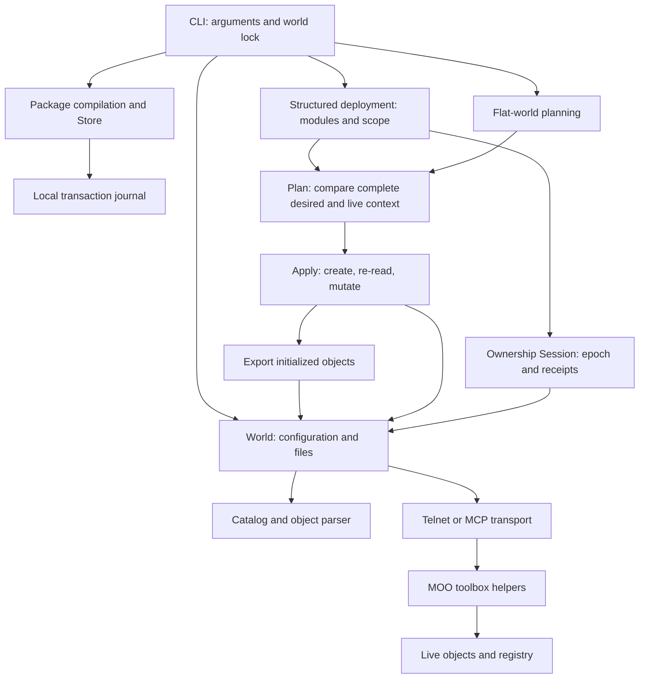

# REVIEW.md — reading terramoo

Last updated: 2026-10-09, commit 4e5c586.

This document is regenerated wholesale from the code with the `review-doc`
skill. Hand edits will be lost on the next regeneration.

Terramoo is a Python CLI that manages a player's MOO objects from local text
files. This guide is for an engineer reviewing or changing its implementation.
Read §1 before editing deployment code, use §2 to locate the larger areas,
then follow §3 with the source open. §4 explains external dependencies; §5
contains verification commands and common change paths.

[README.md](README.md) owns command usage, file syntax, and upgrade instructions.
[AGENTS.md](AGENTS.md) owns implementation constraints and required live tests;
[CLAUDE.md](CLAUDE.md) redirects to it.
[MODULES_AND_PACKAGES_PLAN.md](MODULES_AND_PACKAGES_PLAN.md) records the accepted
requirements, earlier design proposals, and subsequent verification. Its opening
code review describes the pre-implementation revision; use current source for
schemas and behavior. This document maps that source.

## 1. High-level architecture

### Program model and vocabulary

`tmoo` is a synchronous read/compare/write pipeline. World commands load local
configuration and connect when they need live identities or objects; package
source checks work without a world. Each invocation performs one command and
closes its connections. The remote MOO stores the objects and runs the helper
verbs that inspect or mutate them. Packages add a local compilation and
installation layer before the same comparison machinery.

The rule to keep in mind is: **files describe desired objects; the live registry
and generation stamps establish which objects may be changed.**

A *world* is one player/connection configuration and its local directory. A
*registry key* is a world-wide object name. A *module* groups definitions under
a manifest and declares references and initialization order. A *package* is
reusable source containing modules; an *instance* is one installation of that
source into a world. A package can have several independent instances there.

Seven groups of abstractions explain most of the code:

| Abstraction | Responsibility |
|---|---|
| `ObjectDef`, `PropDef`, `VerbDef`, literal types | The shared representation of file and exported object data. `Ref` represents a symbolic reference; `Obj` represents a server identity. |
| `Registry` and `Refs` | Key lookup, generation nonces, registry revision, system references, and pending creates. |
| `World` | Configuration, recursive files, lazy connection, player/toolbox lookup, bootstrap, and registry reads. |
| `Module` and `Modules` | Membership, dependency declarations, and groups that can be applied together. |
| `Package`, `Compiled`, and `Store` | Portable source, instance compilation, retained inventories, and local lifecycle state. |
| `Plan`, `Prepared`, and `Outcome` | Proposed operations, a validated world/scope snapshot, and per-operation results. |
| Ownership `Session` | A remote deployment epoch plus durable intent and completion receipts. |

### Subsystems and dependencies

[cli.py](terramoo/cli.py) coordinates commands. Format and reference modules
work on values; world, storage, transport, and lifecycle modules perform I/O.
Deployment combines those layers. The arrows below show the principal data and
call flow, including the two apply paths.


```mermaid
flowchart TD
    CLI[CLI: arguments and world lock] --> W[World: configuration and files]
    W --> C[Catalog and object parser]
    CLI --> P[Package compilation and Store]
    P --> S[Local transaction journal]
    CLI --> D[Structured deployment: modules and scope]
    CLI --> F[Flat-world planning]
    D --> Plan[Plan: compare complete desired and live context]
    F --> Plan
    D --> O[Ownership Session: epoch and receipts]
    Plan --> A[Apply: create, re-read, mutate]
    A --> E[Export initialized objects]
    E --> W
    A --> W
    O --> W
    W --> T[Telnet or MCP transport]
    T --> H[MOO toolbox helpers]
    H --> R[Live objects and registry]
```

The package compiler imports the shared model and reference walker; it does not
interpret MOO verb bodies. `Store` validates complete candidate worlds in a
temporary directory before committing local changes. `plan.py` imports model,
literal, and reference code, with no world or transport dependency. It performs
no I/O, although `build()` changes the supplied `Refs.pending` set.

Several imports inside functions connect lifecycle operations without creating
module-import cycles. For example, ownership recovery dispatches to import or
migration recovery, and deployment calls removal only after ordinary mutations.
Follow these calls as well as top-level imports when reviewing control flow.

### Runtime: plan and apply

1. The console entry in [pyproject.toml](pyproject.toml) calls `cli.main`.
   `_world` loads configuration through `World.load`; `find_root` searches for
   a worlds directory unless `TMOO_ROOT` overrides it. Connections open only
   when `World.transport` is used. `main` closes worlds recorded in `_open`
   in its `finally` block.
2. `_world_write_lock` takes a nonblocking POSIX file lock. Read commands use
   shared locks; file-writing commands use exclusive locks. It also rejects
   unresolved journals when the requested command cannot recover them.
3. `_structured_world` chooses module/package deployment when a selector,
   module manifest, or package lock exists. Otherwise `_plan` loads files,
   exports live definitions, and calls `plan.build` directly. Subfolders alone
   do not require the structured deployment path.
4. For a structured world, [deployment.prepare](terramoo/deployment.py)
   snapshots object files, manifests, configuration, and package lock. It checks
   inventories, builds the complete module graph, expands the selected providers,
   determines explicitly authorized removals, and checks ownership receipts.
   Desired and live definitions retain whole-world context for comparison.
5. [plan.build](terramoo/plan.py) finds missing references, orders new objects by
   parent, compares definitions, and records removals. `selected` restricts
   mutations; `destroy_keys` restricts removal. It also distinguishes old live
   identities from pending replacements through `Refs.resolve_ref(live=...)`.
6. After the CLI prints the proposal and receives confirmation, `Prepared.run`
   rechecks the snapshot, records standalone membership, and starts an ownership
   `Session`. The session persists proposed create nonces before any create is
   sent and acquires a new remote epoch with a compare-and-set check.
7. Module groups run with providers before consumers. [apply.run](terramoo/apply.py)
   creates parents first, rereads the registry, verifies the returned generations,
   exports initialized objects, and replans their values. Structured execution
   replans the selected group with complete live ancestry. Failed groups block
   dependent groups; a create failure stops the rest of that group.
8. Normal operations are resolved and batched through `tmoo_apply`. An exit's
   endpoint change waits for successful removal from its old room. Each helper
   result is checked; completion receipts are written only for successful
   groups. The flat path also reports per-operation failures, but has no module
   scheduler or package session.
9. Explicit `--destroy` runs only after earlier mutations succeed.
   [removal.py](terramoo/removal.py) checks desired and live incoming references,
   then removes consumers before providers and children before parents. It
   retires ownership only after registry absence is verified. Flat-world apply
   uses its simpler orphan-destruction phase in `apply.run`.

Ordinary reference cycles are allowed: `Modules.build` groups their strongly
connected components using `components`. New objects in the group are created
before their ordinary values are applied. An initialization dependency inside
that group is rejected because it cannot be satisfied. Parent cycles are
rejected independently. Initializers still run inside the MOO's `create`, so
ordinary reciprocal references do not imply that initialization may use them.

### Package lifecycle, export, and recovery

[Package.load](terramoo/packages.py) captures and validates a local source tree,
including the complete list of module roots. Its digest covers the retained
manifest/object snapshot. `Package.compile` assigns instance keys, substitutes
object inputs, and qualifies module dependencies. It rewrites parsed references,
including owners and map keys, while leaving strings and verb code literal.

[Store.prepare_install](terramoo/installation.py) resolves explicitly configured
dependency instances and checks exact package/version/digest requirements.
Installation writes editable definitions, a lock inventory, and a retained source
snapshot locally. It creates no live objects. Normal deployment validates that
snapshot; it does not refresh from the original source directory.

[updates.py](terramoo/updates.py) compares each old compiled file with its edited
installation and newly compiled source. Its `merge` is a whole-file equality
comparison, not a line-merging algorithm. Conflicts produce editable candidates
without replacing active definitions. Resume validates the captured active files
and commits the resolved candidate. Local removal stages tombstones and archives
edits when authorized; remote deletion remains a later apply operation.

[imports.py](terramoo/imports.py) claims explicitly mapped, already managed
objects without recreating them. [migrations.py](terramoo/migrations.py) renames
registry keys through temporary keys, allowing swaps and case-only renames.
It preserves object/generation pairs, then updates definitions, bindings,
compiled baselines, and receipts. Registry-key migrations leave source snapshots
unchanged. Instance renaming changes addresses and paths while retaining keys
and namespace; source-key migration uses the update machinery to retain
installed identities while refreshing the source snapshot.

`pull` and `export` share a command handler. In a structured world,
[views.pull](terramoo/views.py) checks ownership and each selected package
object's deployed revision before exporting. It restores missing definitions at
recorded paths and keeps upgrade baselines intact. It can save a new live
reference and report the missing module declaration for repair before apply.
The flat path uses `_write_exports`, preserving nested paths and existing field
order through `ordered_like`.

There are separate recovery procedures. Local package transactions roll forward
from recorded before/after bytes. Deployment recovery reconciles observed
identities and requires a new plan for remaining values. Import and migration
recovery continue their recorded protocols. The older flat-world key rename has
its own journal and recovery code in `cli.py`; it also attempts a remote reverse
rename if local finalization fails. These procedures are not interchangeable.

### State ownership and persistence

The paths below are a runtime layout under a world's directory, not tracked
source files. Preserve installation metadata together with the editable files.

| State | Authority and writer |
|---|---|
| `world.toml`, `objects/**/*.moo`, nearest `module.toml` | Desired configuration and definitions; users and CLI writers edit them. Folder paths locate files; keys identify objects. |
| `packages.lock.json` | `Store` records schema-1 world/installation identities, source pins, key mappings, compiled baselines, removals, and standalone membership history. |
| `.packages/INSTANCE/base/source.json` | Retained package input, checked against its pinned digest. Updated by explicit lifecycle operations. |
| `.packages/deployment.json` | Global local receipt: remote epoch, connection/player/toolbox identity, per-key generations, and completed desired revisions. Ownership code writes it. |
| `.packages/INSTANCE/deployment.json` | Per-instance receipt subset. The global receipt is read for authorization checks. |
| `.packages/transaction.json` | Local transaction intent with before/after bytes; `storage.transaction` writes it before replacements, and `storage.recover` finishes it. |
| `.packages/operation.json` | Remote deployment/import/migration intent, including identities and progress. Recovery dispatches by its `kind`. |
| `.packages/update-candidate.json`, `.packages/candidates/ID/` | An uncommitted update and its editable conflict resolutions. Managed by `updates`. |
| `.packages/INSTANCE/removal.json`, `.packages/history/ID/` | Archived local edits and retired installation records. Reinstallation gets a new installation UUID. |
| `state.json` | A human-readable registry copy written by `refs.save_state`; it is not loaded to authorize mutations. |
| `state.json.rename-recovery.json` | Flat-world rename recovery state. Current schema 2 records nested paths; schema 1 recovery remains supported. |
| `.cache/write.lock` | OS lock shared by cooperating commands in this checkout. It cannot coordinate another checkout. |
| MOO toolbox registry and protected registry properties | Live key/object/generation bindings and registry revision. Helpers reconcile callbacks and update this state. |
| MOO object generation property | The object's own nonce, including a non-clear value of an inherited property. `tmoo_generation` maintains it. |
| MOO toolbox package ownership property | `{1, world_id, epoch, records}`; each record is `{key, generation, installation_id, desired}`. `tmoo_packages` checks and advances it. |

A registry is represented remotely as `{keys, objects, generations, revision}`:
three parallel lists and a revision. The separate package epoch detects a stale
checkout's ownership claim. It does not replace object generations or the
registry revision used during renames.

There is no atomic transaction spanning files and the MOO. Durable intents,
identity checks, and explicit recovery handle interruption. `storage.recover`
preflights every target before writing and refuses bytes that match neither the
recorded old nor new content. The remote helpers check identity immediately
before mutation and recheck ownership after operations that can invoke callbacks.

### I/O boundaries and invariants

Formats, model normalization, reference resolution, and diffing are testable
without a server. Discovery, `Store`, and local lifecycle preparation touch the
filesystem. `World`, export, apply, ownership, import, and registry migration can
reach the network. [secrets.py](terramoo/secrets.py) reads environment/configuration
or calls macOS `security`. The CLI imports `fcntl` unconditionally, so its lock
implementation requires POSIX; the Windows-only pytest dependency does not imply
Windows CLI support.

- Managed keys are ASCII identifiers with case-insensitive lookup. File/header
  spelling must agree, and discovery rejects duplicate keys and symlinks.
  `me` is reserved for the player alias.
- A recycled object number is insufficient identity. Mutations verify its
  generation; legacy bindings require explicit `adopt --verify`.
- Keep desired and live reference resolution distinct during recreation. A
  consumer's old reference must not appear to target the replacement already.
- Scope expansion includes providers but does not grant permission to remove
  their objects. Missing package files are inventory errors, not removal requests.
- Helpers check `caller_perms()` and permit the toolbox owner or a wizard.
  They use the LambdaMOO 1.8 language subset: parallel lists, `parent`/`children`,
  and `typeof(#0)`, without maps, ancestor builtins, core utilities, or type
  constants. Only export/apply may explicitly suspend, and only when the
  transport supplies permission to do so.
- Application requests are single MOO expressions. Telnet adds its own statement
  wrapper; MCP wraps the expression in `toliteral`. Assignments use `set_prop`.
- Every callback can change the registry or suspend. Keep reconciliation and
  post-callback identity checks around it; a saved Python snapshot is insufficient.
- `tmoo_generation` must read and preserve inherited stamps. Testing only
  `properties(obj)` misses a managed child's own value of an inherited property.
- Object files use mooR-style literals; wire serialization uses the transport's
  dialect. Map-key transformations must detect collisions. Verb code stays literal.
- Runtime properties belong in `DEFAULT_IGNORE_PROPS` or world configuration.
  Generation stamps remain excluded even if requested through `keep_props`.
- Lost responses are uncertain outcomes. Telnet may reconnect before a new
  request, but does not replay a request that might already have mutated objects.
- Secrets come from `TMOO_SECRET`, Keychain, or external configuration files;
  they are not world metadata.

## 2. Quantitative metrics

### Size and inventory

Measured at the header commit with:

```sh
tokei terramoo tests testbeds examples moo-fixtures --output json
git ls-files terramoo tests testbeds examples moo-fixtures | xargs wc -l
```

Tokei supplies code counts and excludes ignored build trees. Physical lines
include comments and blanks. This tokei installation does not classify MOO;
those rows use only the physical counts. The inventory contains 82 tracked files
across these directories; root documentation and manifests are outside the table.

| Area / language | Files | Code lines | Physical lines |
|---|---:|---:|---:|
| `terramoo/`, immediate Python modules | 24 | 5,664 | 6,358 |
| `terramoo/transport/`, Python | 3 | 529 | 598 |
| `terramoo/helper/`, MOO | 8 | — | 1,016 |
| `tests/`, Python | 18 | 4,803 | 5,883 |
| `testbeds/`, Python | 3 | 197 | 241 |
| `testbeds/`, shell | 9 | 347 | 440 |
| `testbeds/`, YAML / MOO / Markdown | 5 | 15 YAML | 70 |
| `examples/`, TOML / MOO | 6 | 13 TOML | 32 |
| `moo-fixtures/`, vendored JSON and provenance | 6 | 861 JSON | 870 |

Runtime source totals 6,956 Python lines plus 1,016 MOO lines. Tests/source is
`5883 / 6956 = 0.85` for Python physical lines, or
`5883 / (6956 + 1016) = 0.74` including helpers. These ratios describe size,
not behavioral coverage. Runtime code consists of 27 Python files and eight
helper verbs; the required helper protocol version is 13.

To reproduce the Python module sizes and test-function count:

```sh
python3 - <<'PY'
import ast
from pathlib import Path
import subprocess
paths = [Path(p) for p in subprocess.check_output(
    ['git', 'ls-files', 'terramoo', 'tests'], text=True).splitlines()]
functions = 0
for path in paths:
    if path.suffix != '.py':
        continue
    text = path.read_text()
    if path.parts[0] == 'terramoo':
        print(len(text.splitlines()), path)
    else:
        functions += sum(isinstance(n, ast.FunctionDef) and n.name.startswith('test_')
                         for n in ast.walk(ast.parse(text)))
print('test functions:', functions)
PY
```

### Tests and dependencies

`uv run --offline pytest --collect-only -q` collected **409 cases** from
**266 test functions in 18 files**. Parametrization accounts for the difference.
`uv run --offline pytest --collect-only -qq` reports counts per file.

| Test area | Collected cases | Boundary exercised |
|---|---:|---|
| Formats, references, vendored corpus | 92 | Parsed values, round trips, identity lookup, protocol fixtures |
| Export, plan, apply | 74 | Comparison and operation semantics, mostly with Python fakes |
| CLI, world, secrets | 107 | Dispatch, locking, filesystem changes, bootstrap and credential fakes |
| Catalog, modules, packages, storage, ownership | 49 | Inventories, scopes, dependency pins, update/import/migration preparation, recovery |
| Telnet and MCP | 43 | Local scripted sockets and mocked HTTP/tool responses |
| Helpers | 32 | Static checks plus real MOO helper execution in an offline LambdaMOO subprocess |
| Live round trips | 12 | CLI and helpers against a running scratch server; skipped without `TMOO_LIVE` |

Helper execution additionally requires locally built LambdaMOO sources and a C
compiler; those tests can skip on a fresh checkout. Live tests cover telnet on
all three testbeds. The hosted MCP path has fakes and corpus checks, not a live
hosted-gate fixture. No coverage percentage is measured here.

`uv tree --offline`, [pyproject.toml](pyproject.toml), and [uv.lock](uv.lock)
show zero runtime third-party packages, one direct development dependency, and
one separate build backend. The development tree has four active transitive
packages on this platform and a fifth Windows-conditional package in the lock.
The build backend and its transitive environment are not pinned by this lock.

### Large files and history

Physical sizes come from `git ls-files terramoo | xargs wc -l`:

| Source file | Lines | Review focus |
|---|---:|---|
| [cli.py](terramoo/cli.py) | 1,404 | Command handlers plus the separate flat-key rename/recovery protocol |
| [tmoo_apply.moo](terramoo/helper/tmoo_apply.moo) | 540 | Mutations, identity checks, callback reconciliation, and exit membership |
| [installation.py](terramoo/installation.py) | 439 | Lock validation, candidate worlds, dependency closure, and installation |
| [world.py](terramoo/world.py) | 434 | Path/configuration rules and remote bootstrap |
| [plan.py](terramoo/plan.py) | 416 | Inheritance, property/verb comparison, exit classification, and scope |
| [telnet.py](terramoo/transport/telnet.py) | 396 | Request framing, byte/character lengths, and uncertain outcomes |

The history contains 61 commits, starting 2026-09-21: 18 calendar days before
this snapshot. Highest file appearance counts are `world.py` 27, `cli.py` 22,
and `test_cli.py`, `tmoo_apply.moo`, and `README.md` 20 each. Commands:

```sh
git rev-list --count HEAD
git log --reverse --format='%h %cs' | head -1
git log --format= --name-only | sort | uniq -c | sort -rn | head -15
```

These are history appearances, not changed-line counts. The package subsystem
arrived in a large recent feature commit, so its low churn understates its review
scope. Read the accepted plan and the lifecycle tests for the intent behind it.

There is no tracked CI workflow or formatter/linter configuration. The manifest
configures pytest discovery and the wheel package; checks are invoked directly.

## 3. Source modules — reading order

### Orientation skim

Start with [pyproject.toml](pyproject.toml), the command list in
[README.md](README.md), and `main` near the end of [cli.py](terramoo/cli.py).
Then inspect [the town package](examples/packages/town/package.toml) and its
[core](examples/packages/town/core/module.toml) and
[rooms](examples/packages/town/rooms/module.toml) manifests. This establishes the
input vocabulary before reading validation. Defer the large CLI rename section.

### Core comparison and execution

Read these in order. Sizes are physical lines from §2's inventory.

1. [model.py](terramoo/model.py), 83 lines, defines the comparison model.
   Read `ObjectDef`, `PropDef`, `VerbDef`, and `ordered_like`. Notice
   `PropDef.defined` and `VerbDef.live_index`; both affect mutations. Leave flag
   normalization until reading the planner.
2. [moolit.py](terramoo/moolit.py), 290 lines, defines values and dialects.
   Read `Ref`/`Obj`, `parse`, `serialize`, and `walk`. Follow recursive map-key
   transformation; defer token-regex details until changing syntax.
3. [objdef.py](terramoo/objdef.py), 267 lines, converts text to that model.
   Read `parse`, `render`, `validate_identifier`, and `_read_statement` after
   understanding literals. Its regular expressions are supporting detail.
4. [refs.py](terramoo/refs.py), 158 lines, gives those references identity.
   Read `Registry`, `Refs.resolve_ref`, `symbolize_obj`, and `replace_registry`.
   Trace both pending and live resolution before touching recreation behavior.
5. [catalog.py](terramoo/catalog.py), 98 lines, and
   [world.py](terramoo/world.py), 434 lines, connect models to inputs and servers.
   Read `discover`, `safe_path`, `read_snapshot`, then `World.load`, `load_files`,
   `refs`, and `bootstrap`. Defer the default property list and toolbox-orphan
   lookup on the first pass. Discovery deliberately works without parsing files.
6. [plan.py](terramoo/plan.py), 416 lines, produces operations from both sides.
   Read `Plan`, `build`, `diff_object`, `_topo`, and `_exit_classes`. This assumes
   the reference rules above. Defer `describe`, which supplies display text.
7. [export.py](terramoo/export.py), 179 lines, validates the live representation.
   Read `export` and `_to_def` alongside
   [tmoo_export.moo](terramoo/helper/tmoo_export.moo), 71 lines. Match each
   returned field to its decoder; defer `slug`, used during adoption.
8. [apply.py](terramoo/apply.py), 302 lines, executes the plan.
   Read `run`, `_replan_created`, `_resolve_op`, `_send`, and `_apply_ops`.
   Follow one create, one endpoint change, and one failure. Review the matching
   operation branches in `tmoo_apply.moo` before changing tuple layouts.

### Modules, packages, and durable operations

9. [modules.py](terramoo/modules.py), 230 lines, adds graph semantics.
   Read `read_manifest`, `references`, `components`, and `Modules.build`.
   Membership comes from the nearest manifest; graph edges point toward
   providers. `Modules.select` is useful background, but CLI deployment uses
   `deployment.scopes` to include historical membership as well.
10. [packages.py](terramoo/packages.py), 260 lines, compiles reusable inputs.
    Read `Package.load`, `binding`, `mapping`, and `compile`. It assumes both
    the object model and module-address rules. Follow input/provider mapping
    before the repetitive schema checks.
11. [storage.py](terramoo/storage.py), 214 lines, explains local durability.
    Read `transaction`, `recover`, `atomic_write`, and `case_alias` before
    lifecycle writers. `canonical_name` completes case-only renames on insensitive
    filesystems. JSON/TOML formatting helpers can wait.
12. [installation.py](terramoo/installation.py), 439 lines, owns inventory.
    Read `Store.__init__`, `validate`, `validate_candidate`, `prepare_install`,
    and `commit`. Trace one candidate into the temporary world, then into a
    journaled commit. Return to `_validate_records` for schema changes.
13. [updates.py](terramoo/updates.py), 293 lines, handles edited installations.
    Read `merge`, `prepare`, `commit_candidate`, `update`, and `remove`.
    Compare source baselines with active files; do not infer line-level merging
    from the command's three-way-update description.
14. [ownership.py](terramoo/ownership.py), 290 lines, connects local identity
    to the MOO. Read `preflight`, `Session.start`, `before_batch`, `after_batch`,
    and `recover` alongside
    [tmoo_packages.moo](terramoo/helper/tmoo_packages.moo), 110 lines.
    Track epoch, proposed nonce, observed generation, and completion revision
    separately. Per-instance receipt formatting is secondary.
15. [deployment.py](terramoo/deployment.py), 230 lines, combines the preceding
    layers. Read `scopes`, `removal_candidates`, `prepare`, `Prepared.run`, and
    `verify_snapshot`. Revisit CLI `_apply_locked` now to see confirmation and
    failure reporting around execution.
16. [removal.py](terramoo/removal.py), 124 lines, performs checked teardown.
    Read `incoming_check`, `run`, and `retire`. The retained definitions and
    manifest history explain ordering after desired files have been removed.
17. [imports.py](terramoo/imports.py), 187 lines, and
    [migrations.py](terramoo/migrations.py), 305 lines, preserve existing
    identities. In each, read `prepare`, `execute`, and `recover`; then read
    `rewrite_membership` and `rename_instance`. Trace a lost remote response
    before following the local metadata rewrites.
18. [views.py](terramoo/views.py), 77 lines, implements guarded pull and package
    status. Read `pull` and `status` after receipts and inventories are familiar.
    Then return to CLI `_pull_locked`, `_adopt_locked`, and `cmd_package`.

### Remote protocol and reference-only code

19. [transport/__init__.py](terramoo/transport/__init__.py), 67 lines, defines
    `Transport`, `connect`, `set_prop`, and `install_verb`.
    [telnet.py](terramoo/transport/telnet.py), 396 lines, implements it through
    `Telnet.eval`, `program`, and `_request`; read the framing docstring first,
    then `_Wire` for socket/negotiation details.
    [mcp.py](terramoo/transport/mcp.py), 135 lines, implements `rpc`, `call_tool`,
    and `eval` with stateless HTTP and JSON/SSE responses. It is a targeted gate
    client, not a general MCP SDK. Read it after the transport contract.
20. Read [tmoo_registry.moo](terramoo/helper/tmoo_registry.moo), 132 lines,
    `bootstrap`/`reconcile`, then
    [tmoo_callback.moo](terramoo/helper/tmoo_callback.moo), 11 lines, and
    [tmoo_generation.moo](terramoo/helper/tmoo_generation.moo), 127 lines,
    `read`/`stamp`/`chparent`/`restamp`. These establish the identity assumptions
    used throughout [tmoo_apply.moo](terramoo/helper/tmoo_apply.moo), 540 lines.
    Read its create/register/rename/destroy branches and callback checks before
    individual property/verb cases. The two small lookup helpers,
    [tmoo_info.moo](terramoo/helper/tmoo_info.moo), 13 lines, and
    [tmoo_sysrefs.moo](terramoo/helper/tmoo_sysrefs.moo), 12 lines, can wait.
21. Return to [cli.py](terramoo/cli.py), 1,404 lines, for flat rename recovery:
    `_world_write_lock`, `_rename_key_locked`, `_read_rename_journal`,
    `_recover_rename_key_locked`, and `_finish_rename_recovery`. This older
    protocol is independent of package transactions; read it only after the
    identity and filesystem checks above are familiar.
22. [secrets.py](terramoo/secrets.py), 73 lines, contains `secret_for`,
    `check_secret`, and `store_secret`. Read when changing login/configuration.
    [errors.py](terramoo/errors.py), 2 lines, and
    [__init__.py](terramoo/__init__.py), 3 lines, contain the shared exception
    and version metadata. The [testbed scripts](testbeds/) are provisioning
    support, not part of normal CLI execution.

### Tests as executable specifications

Start with [test_format.py](tests/test_format.py) and
[test_refs.py](tests/test_refs.py) for round trips and pending identities, then
[test_plan.py](tests/test_plan.py) and [test_apply.py](tests/test_apply.py) for
operations, recreation, and exit ordering.

Read [test_catalog.py](tests/test_catalog.py) and
[test_modules.py](tests/test_modules.py) before changing discovery or scope.
Then follow [test_packages.py](tests/test_packages.py),
[test_storage.py](tests/test_storage.py), and
[test_ownership.py](tests/test_ownership.py) for instance isolation, pinning,
conflict candidates, interrupted writes, and stale receipts.

[test_helper.py](tests/test_helper.py) executes the actual MOO code and covers
callback races that Python fakes cannot establish. Read
[test_live.py](tests/test_live.py) for complete package lifecycles, lost-response
recovery, managed parent/child objects, and the final round trip. The flat rename
failure matrix is in [test_cli.py](tests/test_cli.py). For protocol edits, pair
[test_telnet.py](tests/test_telnet.py) and [test_mcp.py](tests/test_mcp.py) with
[test_corpus.py](tests/test_corpus.py).

## 4. Third-party modules

There are no runtime third-party Python imports. An AST scan of runtime imports
found only the standard library and relative terramoo imports. The direct
manifest dependencies are:

| Dependency | Declared / resolved version | Actual use in this repository |
|---|---|---|
| pytest | `>=8`; locked to 9.1.1 | Development only. Imported in 17 test files for fixtures, parametrization, exceptions, and monkeypatching. `test_plan.py` is collected by pytest without importing it. Configuration is in [pyproject.toml](pyproject.toml). |
| hatchling | Unconstrained build requirement | `hatchling.build` creates the distribution; the wheel target includes `terramoo`. It is referenced by the build-system section, not imported by runtime code. |

`uv tree --offline` shows pytest's active transitive dependencies: iniconfig
2.3.0, packaging 26.3, pluggy 1.6.0, and pygments 2.21.0. The cross-platform lock
also contains colorama 0.4.6 for Windows. No Python framework defines the
architecture; argparse, dataclasses, pathlib, JSON/TOML, sockets, and urllib
supply the runtime mechanisms.

External test material has separate provenance and build rules:

| Component | Pin and integration |
|---|---|
| LambdaMOO and LambdaCore | [setup.sh](testbeds/lambdamoo/setup.sh) pins LambdaMOO 1.8.1 and LambdaCore-17May04 archives by SHA-256. It patches compiler detection and loopback binding. Used for live tests and the offline helper subprocess. |
| ToastStunt and ToastCore | [setup.sh](testbeds/toaststunt/setup.sh) shallow-clones upstream when absent; it does not pin commits. CMake builds the server. Homebrew supplies macOS prerequisites; other platforms are checked for tools/libraries. |
| mooR and lambda-moor | [setup.sh](testbeds/moor/setup.sh) pins commit `7caba6e5d850f33f155f842c311dbae328367af8`, identified there as release 1.0.2. Its comment explains the pin in terms of non-wizard command execution. Cargo builds daemon and hosts; the bundled core is imported for tests. |
| AgiMoo protocol corpus | Five JSON files under [moo-fixtures/](moo-fixtures/), copied from commit `5fb0cde`. [SOURCE](moo-fixtures/SOURCE) records hashes checked by `test_corpus_source_hashes_match`. |

Testbed compiler/server dependencies are not terramoo runtime dependencies or
part of the Python dependency counts. Their downloaded source remains under
ignored build/source directories and retains its upstream licensing.

## 5. Comprehension aids

### Terms that look similar but are different

| Term | Meaning in the implementation |
|---|---|
| Generation / nonce | A per-object identity stamp, proposed before create and checked against the live object. Protects against recycled object numbers. |
| Registry revision | A counter for registry mutations, including callback changes; used by key-rename compare-and-set operations. |
| Deployment epoch | A token for the world's current ownership state. Another checkout's successful activation invalidates an older receipt. |
| Desired revision | An instance's local lifecycle revision. Per-object receipts record whether that revision completed deployment. |
| Baseline | The previously compiled source file used in the next whole-file three-way update. Pull does not replace it. |
| Tombstone | A retained removed definition and membership used to authorize and order later live deletion. |
| Reference group | A strongly connected component of module edges applied together; initialization edges cannot point within it. |
| Corified object / `$name` | An object-valued property on MOO object `#0`, read by `tmoo_sysrefs`. |
| Clear inherited property | An inherited value not overridden on this object. It differs from storing the same value explicitly. |
| Toolbox | A player-owned MOO object containing helper verbs and registry/ownership state, reached through `player.tmoo`. |

### Conventions and files to preserve

Python uses four-space indentation, dataclasses for the shared model, and
`MooError` for command-level failures. Parsers use `ValueError` subclasses;
callers convert errors where file or command context is available. Apply returns
an `Outcome` with successful labels and failures, while remote helpers return
one `{1, value}` or `{0, error, message}` record per operation.

File rendering is deterministic. `ordered_like` preserves the existing property
and verb order on pull. Verb bodies have four spaces of file indentation around
their own MOO indentation. Live verbs have numeric descriptors because names can
repeat; do not replace `VerbTarget` with a name-only mutation.

[uv.lock](uv.lock) is generated dependency state. Refresh it through uv.
[moo-fixtures/](moo-fixtures/) is vendored test data; update its provenance and
hash tests together when replacing it. Ignored `.build`, `.src`, and `.run`
directories beneath testbeds contain downloaded source, binaries, and disposable
test worlds; change tracked setup scripts rather than patching their output.
Installed package definitions are editable, but source snapshots, inventories,
and recovery journals are persistent protocol state, not disposable caches.

### Run and verify

From the repository root:

```sh
uv run pytest
uv run pytest --collect-only -qq
uv run tmoo --help
uv run tmoo package check examples/packages/town
uv build
git diff --check
```

The documentation regeneration ran collection, CLI help, and example validation
with `--offline`; the example contains two modules and three objects. It did not
rerun server suites or build distributions. The checked-in implementation record
in [the plan](MODULES_AND_PACKAGES_PLAN.md#implementation-record-2026-10-09)
reports 397 offline passes and all 12 live tests passing on each server at this
code state. Distinguish that recorded validation from a new test run.

Helper, transport, or plan/apply changes require all three live testbeds,
sequentially, per [AGENTS.md](AGENTS.md). After running each testbed's setup once,
this loop starts, tests, and stops one server at a time:

```sh
for bed in toaststunt lambdamoo moor; do
  case "$bed" in
    toaststunt) port=17001 ;;
    lambdamoo) port=17002 ;;
    moor) port=17003 ;;
  esac
  (
    trap 'bash "testbeds/$bed/stop.sh"' EXIT
    bash "testbeds/$bed/start.sh" || exit
    TMOO_LIVE="127.0.0.1:$port:tester:tester" uv run pytest tests/test_live.py
  ) || exit
done
```

Use the supplied scratch accounts. Fixture teardown recycles registry objects
with no remaining test file; it refuses a registry containing non-test keys.
Do not run unattended `apply --destroy` on a real world. The setup scripts can
download/build servers and install prerequisites; read their testbed READMEs
before first use. A setup reset replaces the test database.

### Common change paths

| Change | Read and edit in this order | Verification to inspect |
|---|---|---|
| Add a managed object field or operation | `model` → `objdef` → export decoder/helper → `plan` → `apply` → helper operation; check `HELPER_VERSION` compatibility | Format/export/plan/apply tests, helper execution, then all live testbeds |
| Extend a module declaration or input rule | `modules.read_manifest`/`Modules.build` → `Package.load`/`compile` → Store candidate validation → deployment scope | Module/package tests plus live ordering behavior when scheduling changes |
| Change package state or identity migration | Store schema/validation → updates/imports/migrations → storage journal → ownership receipts and recovery → views | Interrupted writes, stale epochs, lost responses, import/migrate/update lifecycle tests |
| Change wire serialization or transport behavior | `moolit` dialects → `Transport` → telnet/MCP implementation → bootstrap/export/apply callers | Corpus and transport tests, Unicode/truncated replies, all live testbeds |
| Exclude runtime state from object definitions | `world.DEFAULT_IGNORE_PROPS` and configuration handling → export filtering → desired-file validation | World/export tests and a pull/plan round trip |

### Where to slow down

- `cli.py` contains both ordinary argument handling and a substantial recovery
  implementation. A small command change may interact with a journal guard;
  read the surrounding lock and recovery tests.
- Package preparation rewrites complete TOML configuration through `toml_text`.
  Values are preserved, but comments and original formatting are not retained.
- A package update can conflict even when two edits affect different lines of
  the same file. The implementation intentionally uses file-level comparison.
- Flat and structured apply share low-level operations but differ in scheduling,
  receipts, and deletion policy. Test both routes after changing a shared function.
- Export decoding must retain live ancestry and numeric verb descriptors. A
  limited mutation scope does not imply a limited comparison context.
- A directory rename does not establish a new object or installation identity.
  Installed inventories reject unrecorded moves across modules/instances.
- Local locks coordinate this checkout only. Remote epochs protect structured
  deployments across checkouts; neither mechanism prevents arbitrary in-world
  edits or callback behavior outside the protocol.
- Structured reference analysis cannot see object references hidden in verb
  strings or dynamic code. Removal checks cover managed survivors, not every
  object in the MOO. Initialization dependencies must be declared by authors.
- Helpers and clients are a versioned protocol. Bootstrap installs version 13;
  older flat-only clients do not understand nested inventories or ownership.
  See the README's upgrade and rollback instructions before mixing versions.
- Testbed binaries are platform-specific: LambdaMOO/ToastStunt use
  `.build/<os>-<arch>`, while mooR uses `.build/target-<os>-<arch>`.
  Working databases remain shared under `.run`; do not run simultaneous testbeds
  against a synced copy of the same working database.

For subsequent reading, use [README.md](README.md) for the user's workflow,
[AGENTS.md](AGENTS.md) before a patch, the
[accepted plan](MODULES_AND_PACKAGES_PLAN.md) for lifecycle decisions, and the
[LambdaMOO](testbeds/lambdamoo/README.md),
[ToastStunt](testbeds/toaststunt/README.md), and
[mooR](testbeds/moor/README.md) notes for server-specific validation.
