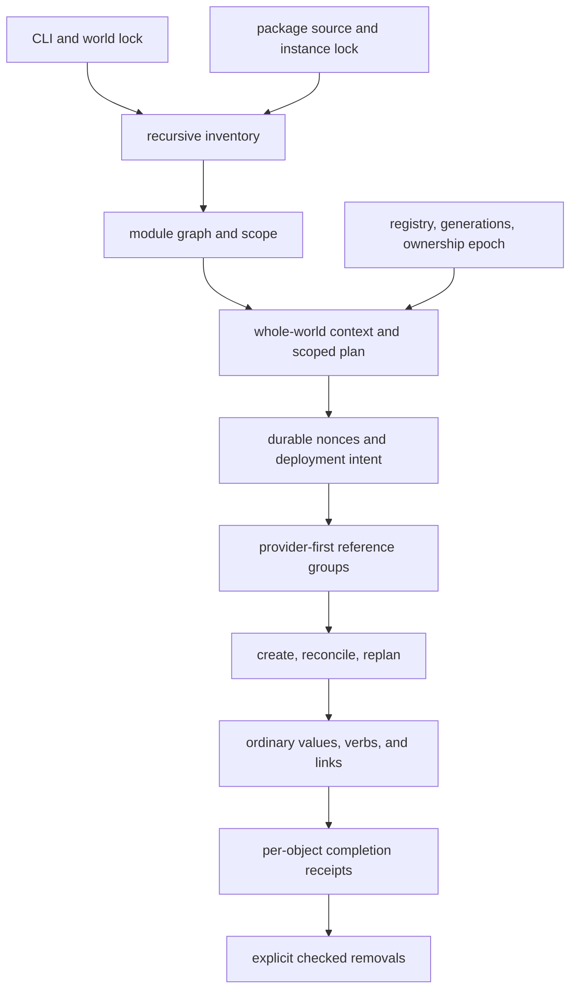

# Reading terramoo's implementation

Updated 2026-10-09 for modules and package instances. [README.md](README.md)
describes the commands; [MODULES_AND_PACKAGES_PLAN.md](MODULES_AND_PACKAGES_PLAN.md)
records the accepted design. [AGENTS.md](AGENTS.md) contains the rules for
changing helpers, transports, and deployment behavior.

Terramoo compares desired definitions with live MOO objects and applies the
difference as the logged-in player. Files identify objects by registry keys.
Mutations check the registry binding and generation. Modules add dependency
scheduling and scopes. Packages compile reusable source into independent,
editable instances in a world.

## Read in this order

| Files | What to follow |
|---|---|
| [model.py](terramoo/model.py), [objdef.py](terramoo/objdef.py), [moolit.py](terramoo/moolit.py) | Object definitions and structured values. `walk` transforms references, including map keys, and rejects collisions. Strings and verb code stay literal. |
| [refs.py](terramoo/refs.py) | Registry generations and `Refs.resolve_ref`. Desired references prefer pending creates; live references resolve to the old identity. |
| [catalog.py](terramoo/catalog.py), [world.py](terramoo/world.py) | Recursive discovery, filename identities, path preservation, configuration, bootstrap, and connection setup. Discovery is separate from parsing so export can repair malformed files. |
| [modules.py](terramoo/modules.py) | Nearest-manifest membership, direct reference declarations, initialization dependencies, connected reference groups, and parent-cycle checks. |
| [packages.py](terramoo/packages.py) | Portable source validation, complete inventories, snapshots, namespaces, typed object inputs, and compilation. |
| [installation.py](terramoo/installation.py), [updates.py](terramoo/updates.py) | Installation inventories, exact dependency pins, local edits, three-way updates, conflict candidates, and staged removal. |
| [plan.py](terramoo/plan.py) | Pure comparison with complete world context and explicit mutation scope. `build` changes `refs.pending`. |
| [deployment.py](terramoo/deployment.py), [apply.py](terramoo/apply.py) | Scope expansion, snapshots, provider-first groups, create/reconcile/replan, ordinary mutations, and failure propagation. |
| [ownership.py](terramoo/ownership.py), [helper/tmoo_packages.moo](terramoo/helper/tmoo_packages.moo) | Deployment epochs, per-key ownership, durable intents, receipts, and recovery. Read these together. |
| [removal.py](terramoo/removal.py), [imports.py](terramoo/imports.py), [migrations.py](terramoo/migrations.py) | Historical membership, checked teardown, existing-object claims, and resumable identity migrations. |
| [storage.py](terramoo/storage.py), [views.py](terramoo/views.py), [cli.py](terramoo/cli.py) | Local write transactions, guarded exports, status, world locks, command dispatch, and legacy rename recovery. |
| [export.py](terramoo/export.py), [transport/](terramoo/transport/), [helper/](terramoo/helper/) | Live object decoding, telnet and MCP transport behavior, and seven plain LambdaMOO 1.8 helper verbs. |

## Execution


```mermaid
flowchart TD
  CLI[CLI and world lock] --> Catalog[recursive inventory]
  Catalog --> Modules[module graph and scope]
  Packages[package source and instance lock] --> Catalog
  Modules --> Preview[whole-world context and scoped plan]
  Remote[registry, generations, ownership epoch] --> Preview
  Preview --> Intent[durable nonces and deployment intent]
  Intent --> Groups[provider-first reference groups]
  Groups --> Create[create, reconcile, replan]
  Create --> Mutate[ordinary values, verbs, and links]
  Mutate --> Receipt[per-object completion receipts]
  Receipt --> Remove[explicit checked removals]
```

`deployment.prepare` freezes the inventory, configuration, and package lock.
It validates the full graph before selecting mutations. Selectors expand
through reference and initialization edges. Only explicitly selected historical
scopes authorize removal. Recreating a provider requires selecting affected
consumers; raw references to its old identity must become managed references.

Reference-only cycles form one group. Its new objects are created in parent
order before ordinary values and links are applied. An initialization edge
inside the group is impossible and fails validation. Providers finish before
consumer groups start; failures prevent dependent groups from running.
Creation callbacks run immediately. Authors must declare their readiness
requirements.

`apply.run` rereads created objects because initialization can change them.
Scoped replanning retains all live managed ancestors when classifying exits.
Each remote batch has a durable intent. Unknown responses retain the journal;
recovery reconciles identities before a fresh apply replans values. Successful
receipts record the actual selected desired revision.

Removal checks desired and live references from surviving managed objects,
then processes consumers before providers and children before parents. Each
deletion verifies the receipt's object and generation. A failure stops later
deletions. History remains, and ownership is released only after registry
absence is verified.

Flat worlds without manifests or a package lock continue through the original
plan/apply path, with recursive discovery and generation checks.

## State and recovery

| Location | Contents and authority |
|---|---|
| `objects/**/*.moo`, nearest `module.toml` | Desired definitions and effective membership. Keys are unique throughout the world. |
| `world.toml` | Connection settings and named package declarations. Source paths are relative to the world's directory. |
| `packages.lock.json` | Schema 1 world identity, installation UUIDs, source/dependency pins, mappings, compiled baselines, tombstones, and standalone membership history. |
| `.packages/INSTANCE/base/source.json` | Immutable source inventory whose digest is pinned by the lock. Normal commands use this snapshot. |
| `.packages/deployment.json`, `.packages/INSTANCE/deployment.json` | Deployment epoch, endpoint/player/toolbox identity, generations, and desired revision receipts. The global receipt is authoritative locally; instance files contain subsets. |
| `.packages/transaction.json` | Local journal with old/new bytes. Recovery preflights every target and rolls forward without discarding concurrent edits. |
| `.packages/operation.json` | Remote deployment, import, or migration intent persisted before mutation. Proposed create nonces survive lost responses. |
| `.packages/update-candidate.json`, `.packages/candidates/ID/` | Captured old/local/new proposal and editable resolutions. Resume checks active snapshots; candidate removal is included in the commit transaction. |
| `.packages/INSTANCE/removal.json`, `.packages/history/ID/` | Archived edits and retired installation history. Reinstalling a removed name allocates a new UUID. |
| `state.json` | Registry cache; it cannot authorize remote changes. |
| `state.json.rename-recovery.json` | Legacy single-key rename journal. Version 2 records nested paths; version 1 recovery remains supported. |

The registry is `{keys, objects, generations, revision}`. Protected registry
state and a separate revision detect stale or callback-replaced bindings.
Helper version 12 adds package ownership state:

```text
{1, world_id, epoch, {{key, generation, installation_id, desired}, ...}}
```

`tmoo_packages:begin` compares the previous epoch and verifies ownership and
generations. Owned operations carry the current token. Desired owned objects
cannot be destroyed; pending removals cannot receive ordinary updates. Import
permits a verified transfer from this world's standalone ownership to an
installation. Another installation's objects cannot be claimed. A new epoch
invalidates stale checkout receipts.

Key migration journals a sequence through unique temporary keys, including
swaps and case-only renames. Each step checks object, generation, registry
revision, and ownership token. The helper renames the ownership record with
the registry key. Recovery reconciles completed steps instead of repeating
them. Local mappings, references, bindings, and baselines commit after the
remote sequence is verified; source snapshots remain immutable.

Local transactions fsync the intent, replaced files, and affected directories.
The filesystem lock coordinates one checkout; remote epochs detect another
checkout's work. Filesystem and MOO changes are not one atomic transaction.
Unknown outcomes remain intents. Concurrent edits or mismatched identities
stop recovery rather than authorize a guessed operation.

## Invariants to preserve

- Use registry generations and recorded installation UUIDs for identity and
  ownership. Do not infer them from directories or key prefixes.
- Keep complete ancestry and reference context when restricting mutations.
  Dependency expansion must not expand removal authorization.
- Separate initialization requirements from ordinary references. A cycle of
  values does not imply a cycle of creation parents.
- Persist create nonces before sending. Reconcile uncertain transport outcomes
  and produce a fresh plan; do not resend an unknown request automatically.
- Validate inventories before treating absence as removal. Missing package
  files or manifests are not removal requests.
- Check package identity and desired/deployed revisions before a pull batch.
  Report declarations required by newly exported references.
- Keep runtime properties in `DEFAULT_IGNORE_PROPS` or world configuration,
  without planner exceptions.
- Every helper checks `caller_perms()`, stays compatible with LambdaMOO 1.8,
  and suspends only when the transport permits it.
- Transport requests contain one MOO expression. Loops belong in helpers;
  assignments use `Transport.set_prop`.

## Verification and limits

The runtime uses Python's standard library. `pytest` is a development
dependency and `hatchling` builds the wheel. Local MOO servers are fixtures.

Read `test_catalog.py` and `test_modules.py` for path/graph rules;
`test_packages.py` and `test_storage.py` for isolation, pins, updates, imports,
migrations, and interrupted writes; `test_plan.py` and `test_apply.py` for
mutation semantics. `test_helper.py` compiles and runs the actual helpers
with a local LambdaMOO subprocess. Transport tests cover telnet and fake MCP
responses. `test_live.py` exercises CLI round trips, independent package
lifecycles, import and migration recovery, guarded pulls, and cyclic-module
creation recovery against each server.

```sh
uv run pytest
testbeds/toaststunt/start.sh --fresh
TMOO_LIVE=127.0.0.1:17001:tester:tester uv run pytest tests/test_live.py
testbeds/toaststunt/stop.sh
# Repeat sequentially for lambdamoo:17002 and moor:17003.
```

Run all three live testbeds after helper, transport, or plan/apply changes.
Use scratch worlds: teardown recycles test objects. The fixture refuses a
registry containing non-test keys.

Static checks cover structured references, including owners and map values.
They cannot discover arbitrary references in verb code, strings, or callbacks.
Unmanaged live objects are outside the incoming-reference inventory. Changes
made outside this protocol can require reconciliation with matching world
metadata. Old flat-only clients do not understand this inventory and can
propose destructive removals; upgrade clients together.
